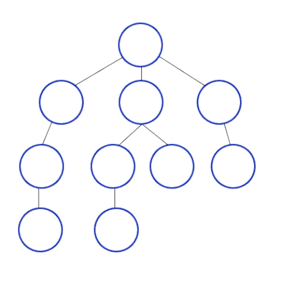

# :books: DFS & BFS <sub>깊이 우선 탐색 & 거리 우선 탐색</sub>

## :bookmark_tabs: 목차

[:arrow_up: **Algorithm**](../README.md)

1. ### [DFS](#📕-dfs-depth-first-search-깊이-우선-탐색) <sub>Depth-First Search, 깊이 우선 탐색</sub>

   - 정의
   - 특징
   - DFS의 동작 원리
   - 알고리즘
   - 복잡도
   - 장단점

2. ### [BFS](#📙-bfs-breadth-first-search-너비-우선-탐색) <sub>Breadth-First Search 너비 우선 탐색</sub>

   - 정의
   - 특징
   - BFS의 동작 원리
   - 알고리즘
   - 복잡도
   - 장단점

# :closed_book: DFS <sub>Depth-First Search, 깊이 우선 탐색</sub>

## 정의

> 시작 정점에서 특정 분기<sub>Branch</sub>를 선택해 다음 분기까지 (또는 분기의 종단까지) 탐색하고 되돌아오는 방법으로 트리 또는 그래프를 순회하거나 검색하기 위한 알고리즘

## 특징

- 인접 행렬<sub>Adjacency Materix</sub> 또는 인접 리스트<sub>Adjacency List</sub>를 통해 구현된 트리 또는 그래프 자료구조를 대상으로 수행됨
- 특정 분기<sub>Branch</sub>를 선택해 탐색하고 되돌아오는 백트래킹<sub>Backtracking</sub>이 가능
- 주로 스택<sub>Stack</sub> 자료구조를 사용해서 구현
- 재귀적으로 동작하는 코드로 작성할 수 있음

## DFS의 동작 원리




1. 선택된 시작 정점를 기준으로 다음으로 진행할 수 있는 간선을 선택
   - 이미 진행한 적이 있는 분기라면 진행하지 않은 다른 간선을 선택
   - 더 선택할 수 있는 분기가 없으면 탐색 종료
2. 간선의 도착 정점을 기준으로 1번을 반복
   - 조건을 충족한 목표 노드를 발견했으면 탐색 종료

## 알고리즘

Procedure

```
procedure DFS(G, v) is
    label v as discovered
    for all directed edges from v to w that are in G.adjacentEdges(v) do
        if vertex w is not labeled as discovered then
            recursively call DFS(G, w)
```

```
procedure DFS_iterative(G, v) is
    let S be a stack
    S.push(v)
    while S is not empty do
        v = S.pop()
        if v is not labeled as discovered then
            label v as discovered
            for all edges from v to w in G.adjacentEdges(v) do
                S.push(w)
```

## 복잡도

| 연산 종류             | 평균<sub>Avg</sub> | 최악<sub>Worst</sub> |
| --------------------- | ------------------ | -------------------- |
| 공간<sub>Space</sub>  | `O(V)`             | `O(V)`               |
| 탐색<sub>Search</sub> | `O(E+V)`           | `O(E+V)`             |

- `V`는 정점의 개수, `E`는 간선의 개수

| 연산 종류             | 평균<sub>Avg</sub> | 최악<sub>Worst</sub> |
| --------------------- | ------------------ | -------------------- |
| 공간<sub>Space</sub>  | `O(bd)`            | `O(bd)`              |
| 탐색<sub>Search</sub> | `O(b^d)`           | `O(b^d)`             |

- 다른 표현으로 `b`는 분기의 개수, `d`는 탐색 깊이

## 장단점

- ### 장점

  - 현재 분기상의 정점들 만을 기억하면 되므로 요구되는 저장 공간이 적은 편
  - 목표가 깊은 단계에 있을 경우 BFS에 비해 해를 빨리 구할 수 있음

- ### 단점

  - 해가 없는 경로에 깊이 빠질 가능성이 존재  
    최대 탐색 깊이를 지정하고 해당 범위 안에 목표를 발견하지 못하면 같은 깊이의 다른 분기를 우선 탐색하도록 개선
  - 얻어진 해가 최단 경로가 된다는 보장이 없음

# :orange_book: BFS <sub>Breadth-First Search 너비 우선 탐색</sub>

## 정의

> 시작 정점에 인접한 정점을 먼저 선택해 탐색하는 방법으로 트리 또는 그래프를 순회하거나 검색하기 위한 알고리즘

## 특징

- 인접 행렬<sub>Adjacency Materix</sub> 또는 인접 리스트<sub>Adjacency List</sub>를 통해 구현된 트리 또는 그래프 자료구조를 대상으로 수행됨
- 인접한 정점을 우선적으로 탐색하는 특징으로 가장 먼저 찾은 해는 최단 경로가 됨
- 주로 큐<sub>Queue</sub>나 힙<sub>Heap</sub> 자료구조를 사용해서 구현

## BFS의 동작 원리


1. 선택된 시작 정점들을 기준으로 다음으로 진행할 수 있는 간선을 **전부** 선택
   - 이미 진행한 적이 있는 분기라면 진행하지 않은 다른 간선을 선택
   - 더 선택할 수 있는 간선이 없으면 탐색 종료
2. 간선의 도착 정점들을 기준으로 1번을 반복
   - 조건을 충족한 목표 노드를 발견했으면 탐색 종료

## 알고리즘

Procedure

```
BFS(G, root) is
    let Q be a queue
    label root as explored
    Q.enqueue(root)
    while Q is not empty do
        v := Q.dequeue()
        if v is the goal then
            return v
        for all edges from v to w in G.adjacentEdges(v) do
            if w is not labeled as explored then
                label w as explored
                w.parent := v
                Q.enqueue(w)
```

## 복잡도

| 연산 종류             | 평균<sub>Avg</sub> | 최악<sub>Worst</sub> |
| --------------------- | ------------------ | -------------------- |
| 공간<sub>Space</sub>  | `O(V)`             | `O(V)`               |
| 탐색<sub>Search</sub> | `O(E+V)`           | `O(E+V)`             |

- `V`는 정점의 개수, `E`는 간선의 개수

| 연산 종류             | 평균<sub>Avg</sub> | 최악<sub>Worst</sub> |
| --------------------- | ------------------ | -------------------- |
| 공간<sub>Space</sub>  | `O(b^d)`           | `O(b^d)`             |
| 탐색<sub>Search</sub> | `O(b^d)`           | `O(b^d)`             |

- 다른 표현으로 `b`는 분기의 개수, `d`는 탐색 깊이

## 장단점

- ### 장점

  - 목표가 얕은 단계에 있을 경우 DFS에 비해 해를 빨리 구할 수 있음
  - 처음으로 얻어진 해는 항상 최단 경로임을 보장

- ### 단점

  - 목표가 깊은 단계에 있을 경우 탐색이 느리고 요구 저장 공간이 많아짐
