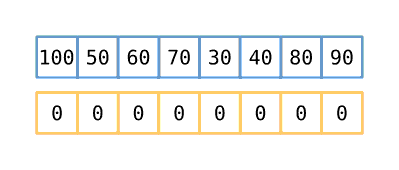

# :books: LIS <sub>최장 증가 부분 수열</sub>

## :bookmark_tabs: 목차

[:arrow_up: **Algorithm**](../README.md)

1. ### [LIS](#📕-lis-longest-increasing-subsequence-최장-증가-부분-수열) <sub>Longest Increasing Subsequence, 최장 증가 부분 수열</sub>

   - 정의
   - 특징
   - LIS의 동작 원리
   - 알고리즘
   - 복잡도

# :closed_book: LIS <sub>Longest Increasing Subsequence, 최장 증가 부분 수열</sub>

## 정의

> 원소가 n개인 수열의 일부 원소를 순차적으로 골라내서 만든 부분 수열<sub>Subsequence</sub> 중, 오름차순으로 정렬된 가장 긴 수열을 최장 증가 부분 수열<sub>Longest Increasing Subsequence</sub>을 구하는 알고리즘

## 특징

- 임의의 수열에서 일부 원소를 골라내서 만든 수열 중 다음 조건을 만족
  - 임의로 선택된 각 원소가 이전에 선택된 원소보다 큼
  - 그렇게 선택된 원소들로 이루어진 수열의 길이가 최대인 부분 수열
- 한 수열에서 여러개의 최장 증가 부분 수열을 찾을 수 있음
- 대표적인 동적 계획법<sub>Dynamic Programming</sub>을 활용하는 알고리즘

## LIS의 동작 원리

### 기본적인 LIS의 동작



1. 주어진 원본 수열의 원소를 순차적으로 선택
2. LIS를 저장하는 공간에 선택된 원소를 삽입. 아래 규칙을 적용
   1. LIS를 저장하는 배열을 순차적으로 탐색
   2. 탐색하면서 원본 수열에서 선택된 원소를 LIS의 각 요소와 비교
   3. 선택된 요소가 LIS의 요소보다 더 작을 경우 값을 교환
   4. 교환할 수 있는 값이 없을 경우
      1. 현재 LIS의 마지막 값보다 큰 경우, LIS의 마지막 다음에 삽입
      2. 현재 LIS의 마지막 값보다 작은 경우, 해당원소를 LIS에 넣지 않음
3. 원본 수열의 모든 원소를 대상으로 해당 1, 2번을 반복

### 이진탐색<sub>Binary Search</sub>으로 개선된 LIS의 동작

(여기에 관련 이미지 삽입 필요)

- 기존의 알고리즘은 LIS[i]를 계산하기 위해 현재 작성중인 LIS[0] ~ LIS[i-1]를 전부 탐색해야하므로 총 `O(N^2)`의 시간 복잡도를 요구함
- LIS[j] = k를 만족하는 j 중 LIS[j]의 값이 가장 작은 j를 따로 저장하면 LIS[i] (i > j) 를 계산할 때 그 값만 참조하면 LIS[i]의 값을 쉽게 구할 수 있음
- TMP는 오름차순으로 정렬되므로 [이진 탐색](./BinarySearch.md)<sub>Binary Search</sub> 시간복잡도 `O(logN)`안에 탐색됨
- 모든 요소를 순회하는 `O(N)`과 합쳐 `O(NlogN)` 시간 안에 LIS를 찾을 수 있음

1. 주어진 원본 수열의 원소를 순차적으로 선택
2. LIS를 저장하는 공간에 선택된 원소를 삽입. 아래 규칙을 적용
   1. TMP를 참조해 LIS를 저장하는 배열을 탐색
   2. 탐색하면서 원본 수열에서 선택된 원소를 LIS의 요소와 비교
   3. 선택된 요소가 LIS의 요소보다 더 작을 경우 값을 교환하고 같은 위치의 TMP 갱신
   4. 교환할 수 있는 값이 없을 경우
      1. 현재 LIS의 마지막 값보다 큰 경우, LIS의 마지막 다음에 삽입
      2. 현재 LIS의 마지막 값보다 작은 경우, 해당원소를 LIS에 넣지 않음
   5. 삽입된 값을 각 LIS의 각 요소 위치의 최소값을 저장하는 공간 TMP에 기록
3. 원본 수열의 모든 원소를 대상으로 해당 1, 2번을 반복

## 알고리즘

Procedure

```
procedure LIS(arr) is
    while true do
        Sub[] := all possible subsequences in arr
        maxLis := 1
        for S in Sub do
          if S is increasing subsequences then
              len := length of S
              maxLis := Max(maxLis, len)
        return maxLis
```

```
procedure LIS(arr) is
    Lis[n] := 1,1,1,1,1,...,1
    for i is 2...n do
        for j is 1...i-1 do
        if arr[i] > arr[j] and Lis[i] <= Lis[j] then
            Lis[i] := Lis[j] + 1;
    return Max(Lis[0], Lis[0], ..., Lis[n])
```

(logN procedure LIS 추가 필요)

JAVA

```java
public int LIS(int[] dp, int[] A) {
  for (int i = 1; i < N; i++) {
    dp[i] = 1;

    for(int j=0; j<i; j++) {
      if(A[i] > A[j] && dp[j] + 1 > dp[i]) {
        dp[i] = dp[j] + 1;
      }
    }

    lis = Math.max(lis, dp[i]);
  }

  return lis;
}
```

```java
public int ImprovedLIS(int[] dp, int[] A, int[] D) {
  for (int i = 1; i <= N; i++) {
    int idx = binarySearch(dp, 0, dp.length - 1, A[i]);

    if (A[i] > dp[idx]) {
      D[i] = idx + 1;
      dp[idx + 1] = A[i];
    } else {
      D[i] = idx;
      dp[idx] = A[i];
    }

    lis = Math.max(lis, D[i]);
  }

  return lis;
}
```

## 복잡도

### 기본 알고리즘

| 연산 종류             | 평균<sub>Avg</sub> | 최악<sub>Worst</sub> |
| --------------------- | ------------------ | -------------------- |
| 공간<sub>Space</sub>  | `O(N)`             | `O(N)`               |
| 탐색<sub>Search</sub> | `O(N^2)`           | `O(N^2)`             |

### 이분탐색을 활용한 알고리즘

| 연산 종류             | 평균<sub>Avg</sub> | 최악<sub>Worst</sub> |
| --------------------- | ------------------ | -------------------- |
| 공간<sub>Space</sub>  | `O(N)`             | `O(N)`               |
| 탐색<sub>Search</sub> | `O(NlogN)`         | `O(NlogN)`           |

- `N`은 수열을 이루는 원소의 개수
