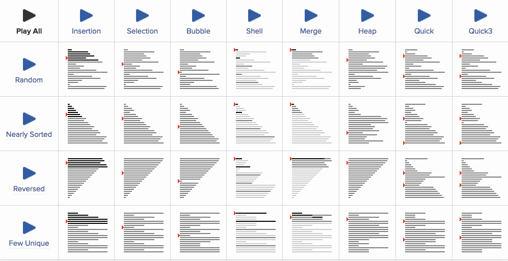

# :books: Sorting <sub>정렬</sub>

## :bookmark_tabs: 목차

[:arrow_up: **Algorithm**](../README.md)

1. ### [Sorting](#) <sub>정렬</sub>

   - 정의
   - [**삽입 정렬**]() <sub>Insertion Sort</sub>
   - [**거품 정렬**]() <sub>Bubble Sort</sub>
   - [**선택 정렬**]() <sub>Selection Sort</sub>
   - [**셸 정렬**]() <sub>Shell Sort</sub>
   - [**퀵 정렬**]() <sub>Quick Sort</sub>
   - [**병합 정렬**]() <sub>Merge Sort</sub>
   - [**힙 정렬**]() <sub>Heap Sort</sub>
   - [**기수 정렬**]() <sub>Radix Sort</sub>
   - [**계수 정렬**]() <sub>Count Sort</sub>

# :closed_book: Sorting <sub>정렬</sub>

## 정의

> 데이터를 정해진 조건에 맞도록 정렬된 순서로 배열하는 것을 알고리즘<sub>Algorithm</sub>

## 정렬 알고리즘 동작 한눈에 보기



## 삽입 정렬 <sub>Insertion Sort</sub>

### 특징

- 손으로 카드를 정렬하는 방식과 유사하게 작동하는 정렬 알고리즘
- 정렬된 영역과 정렬되지 않은 영역으로 구분함
- 정렬되지 않은 영역의 값을 선택해 정렬된 영역의 알맞은 위치에 배치

### 동작 원리

1. 왼쪽에서부터 시작해 인접한 요소를 비교해 현재 선택된 요소가 더 작으면 요소를 왼쪽에 배치
2. 선택한 요소가 더 이상 왼쪽으로 이동할 수 없으면 다음 요소를 선택
3. 이 과정은 모든 데이터가 더 이상 위치가 바뀌지 않을 때 까지 반복

### 알고리즘

```java
public class InsertionSort {
	void sort(int arr[])
	{
		int n = arr.length;
		for (int i = 1; i < n; ++i) {
			int key = arr[i];
			int j = i - 1;

			while (j >= 0 && arr[j] > key) {
				arr[j + 1] = arr[j];
				j = j - 1;
			}
			arr[j + 1] = key;
		}
	}

	static void printArray(int arr[])
	{
		int n = arr.length;
		for (int i = 0; i < n; ++i)
			System.out.print(arr[i] + " ");

		System.out.println();
	}

	public static void main(String args[])
	{
		int arr[] = { 12, 11, 13, 5, 6 };

		InsertionSort ob = new InsertionSort();
		ob.sort(arr);

		printArray(arr);
	}
};
```

## 선택 정렬 <sub>Selection Sort</sub>

### 특징

- 정렬되지 않은 부분에서 가장 작은 요소를 반복적으로 선택하고 목록의 정렬된 부분으로 이동시키는 정렬 알고리즘

### 동작 원리

1. 왼쪽에서부터 시작해 선택한 요소와 오른쪽의 모든 요소를 비교해 가장 작은 값을 찾아 서로 교환
2. 오른쪽으로 한 칸 이동하고 1번 반복, 선택된 요소의 왼쪽은 이미 정렬됐으므로 선택하지 않음
3. 이 과정은 모든 데이터가 더 이상 위치가 바뀌지 않을 때 까지 반복

### 알고리즘

```java
public class SelectionSort {
	void sort(int arr[]) {
		int n = arr.length;

        for (int i = 0; i < n-1; i++)
        {
            int min_idx = i;
            for (int j = i+1; j < n; j++)
                if (arr[j] < arr[min_idx])
                    min_idx = j;

            int temp = arr[min_idx];
            arr[min_idx] = arr[i];
            arr[i] = temp;
        }
	}

	static void printArray(int arr[])
	{
		int n = arr.length;
		for (int i = 0; i < n; ++i)
			System.out.print(arr[i] + " ");

		System.out.println();
	}

	public static void main(String args[])
	{
		int arr[] = { 64, 25, 12, 22, 11};

		SelectionSort ob = new SelectionSort();
		ob.sort(arr);

		printArray(arr);
	}
};
```

## 거품 정렬 <sub>Bubble Sort</sub>

### 특징

- 정렬되지 않은 인접한 요소를 반복적으로 교환하여 작동하는 정렬 알고리즘

### 동작 원리

1. 왼쪽에서부터 시작해 인접한 요소를 비교하면 더 높은 요소가 오른쪽에 배치
2. 1번을 모든 요소에 대해 반복하면 가장 큰 요소는 가장 오른쪽 끝으로 이동
3. 이 과정은 모든 데이터가 더 이상 위치가 바뀌지 않을 때 까지 반복

### 알고리즘

```java
public class BubbleSort {
	void sort(int arr[]) {
		int n = arr.length;
        boolean swapped;

        for (int i = 0; i < n - 1; i++) {
            swapped = false;
            for (int j = 0; j < n - i - 1; j++) {
                if (arr[j] > arr[j + 1]) {

                    int temp = arr[j];
                    arr[j] = arr[j + 1];
                    arr[j + 1] = temp;
                    swapped = true;
                }
            }

            if (swapped == false)
                break;
        }
	}

	static void printArray(int arr[])
	{
		int n = arr.length;
		for (int i = 0; i < n; ++i)
			System.out.print(arr[i] + " ");

		System.out.println();
	}

	public static void main(String args[])
	{
		int arr[] = { 64, 34, 25, 12, 22, 11, 90 };

		BubbleSort ob = new BubbleSort();
		ob.sort(arr);

		printArray(arr);
	}
};
```

## 셸 정렬 <sub>Shell Sort</sub>

### 특징

- 삽입 정렬의 변형으로 어느정도 정리 되었을때 빠른 것을 고려해 일정 범위의 소팅 구간<sub>gap</sub>을 설정해 삽입 정렬을 진행하는 정렬 알고리즘

### 동작 원리

1. 정렬해야 할 리스트의 각 k번째 요소를 추출해서 부분 리스트인 간격<sub>gap</sub>을 생성
   - 간격의 초깃값: (정렬할 값의 수)/2 + 1의 홀수로 이루어진 값
   - 각 회전마다 간격 k를 절반으로 줄이며 1이 될때 까지 반복
2. 왼쪽에서부터 시작해 간격 안의 인접한 요소를 비교해 현재 더 작은 요소를 왼쪽에 배치
3. 선택한 요소가 더 이상 왼쪽으로 이동할 수 없으면 다음 요소를 선택
4. 이 과정은 간격이 1이 되거나 모든 데이터가 더 이상 위치가 바뀌지 않을 때 까지 반복

### 알고리즘

```java
public class ShellSort {
	void sort(int arr[]) {
		int n = arr.length;

        for (int gap = n/2; gap > 0; gap /= 2) {
            for (int i = gap; i < n; i += 1) {
                int temp = arr[i];

                for (int j = i; j >= gap && arr[j - gap] > temp; j -= gap) {
                    arr[j] = arr[j - gap];
                }
                arr[j] = temp;
            }
        }
	}

	static void printArray(int arr[])
	{
		int n = arr.length;
		for (int i = 0; i < n; ++i)
			System.out.print(arr[i] + " ");

		System.out.println();
	}

	public static void main(String args[])
	{
		int arr[] = { 12, 34, 54, 2, 3 };

		ShellSort ob = new ShellSort();
		ob.sort(arr);

		printArray(arr);
	}
};
```

## 복잡도

| 정렬 알고리즘 종류       | 최선<sub>Best</sub> | 평균<sub>Avg</sub> | 최악<sub>Worst</sub> | 공간<sub>Space</sub> |
| ------------------------ | ------------------- | ------------------ | -------------------- | -------------------- |
| 삽입<sub>Insertion</sub> | `O(N)`              | `O(N^2)`           | `O(N^2)`             | `O(1)`               |
| 거품<sub>Bubble</sub>    | `O(N)`              | `O(N^2)`           | `O(N^2)`             | `O(1)`               |
| 선택<sub>Selection</sub> | `O(N^2)`            | `O(N^2)`           | `O(N^2)`             | `O(1)`               |
| 셸<sub>Shell</sub>       | `O(NlogN)`          | `O((NlogN)^2)`     | `O((NlogN)^2)`       | `O(1)`               |
| 퀵<sub>Quick</sub>       | `O(NlogN)`          | `O(NlogN)`         | `O(N^2)`             | `O(logN)`            |
| 병합<sub>Merge</sub>     | `O(NlogN)`          | `O(NlogN)`         | `O(NlogN)`           | `O(N)`               |
| 힙<sub>Heap</sub>        | `O(NlogN)`          | `O(NlogN)`         | `O(NlogN)`           | `O(1)`               |
| 기수<sub>Radix</sub>     | `O(NK)`             | `O(NK)`            | `O(NK)`              | `O(N+K)`             |
| 계수<sub>Count</sub>     | `O(N+K)`            | `O(N+K)`           | `O(N+K)`             | `O(K)`               |
