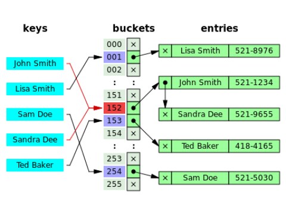
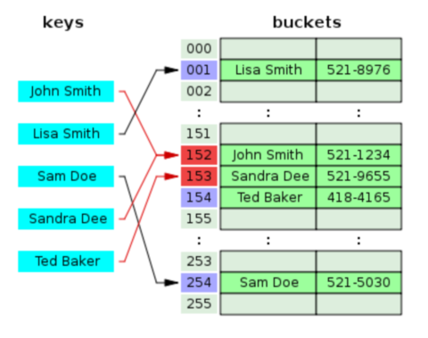
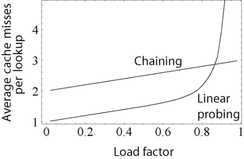

# :books: HashTable & Map & Set 해시테이블와 맵 그리고 셋

## :bookmark_tabs: 목차

[:arrow_up: **DataStructure**](./README.md)

1. ### [HashTable](#📕-hashtable-해시테이블) 해시테이블

   - 정의
   - 특징
   - 해시 함수
   - 해시 충돌을 해결 하는 방법
   - 크기 조정
   - 복잡도
   - 장단점
   - 활용

2. ### [Map](#📙-map-맵) 맵

   - 정의
   - 특징
   - 맵의 구현체 종류
   - 복잡도
   - 장단점
   - 활용

3. ### [Set](#📗-set-셋) 셋

   - 정의
   - 특징
   - 셋의 구현체 종류
   - 복잡도
   - 장단점
   - 활용

# :closed_book: HashTable 해시테이블

## 정의

> 임의의 길이를 가진 데이터를 고정된 길이의 값으로 바꾸어 사용하는 해시 함수Hash Function를 사용해 데이터를 키쌍Key-Value으로 관리하는 자료구조

## 특징

- 해시 함수Hash Function의 해시를 통해 Key-Value의 쌍의 구조로 구현
- 테이블Table 또는 버킷Bucket이라 부르는 고정 크기 배열에 인덱싱Indexing해 데이터를 저장 하며, 이 과정을 해싱Hashing이라 함
- 해시 테이블HashTable의 모식도  
  
- 무한 길이의 데이터를 유한 길이로 줄이므로 이 과정에서 중복되는 Key가 발생할 수 있으며, 이러한 일을 충돌(Collision)이라 부름
  > Collision : 서로 다른 두 개의 키가 같은 인덱스로 해싱되는 현상

## 해시 함수 Hash Function

### 해시 함수의 조건

- 임의의 길이를 가진 키를 `ADD` 또는 `XOR`과 같은 패리티 보존 연산자를 사용하여 단어 또는 다른 단위로 접어서 고정된 길이의 키로 변환
- 결과 값이 키 공간에 균일하게 분포되도록 키의 비트를 스크램블
  > Scrambles : 무작위 방식으로 데이터의 각 비트를 섞어버리는 것
- 키 값을 테이블 크기보다 작거나 같은 값으로 매핑

### 좋은 해시 함수란?

1. 계산 속도가 빠르고 구조가 가벼울 것
   - 해시가 필요한 모든 연산에 전처리로 포함 될 것이므로 무거우면 불리함
2. 출력된 해시의 충돌이 최소화 되어야 할 것
   - 해시의 충돌이 많아질 수록 인덱싱과 체이닝에 로스가 발생, 시간 복잡도가 `O(1)` -> `O(N)`으로 점차 증가함

## 해시 충돌 Hash Collision을 해결 하는 방법

### Separate Chaining 분리 연결법

- 동일한 버킷의 데이터에 대해 리스트와 같은 자료구조를 사용해 같은 인덱스에 메모리를 추가 할당하는 해결법  
  
- 동일한 버킷으로 접근하는 데이터들을 연결Chaining해 관리함
- 해시 버킷의 물리적인 확장 없이 손쉽게 구현 가능
- 중복 인덱스를 가지는 데이터가 많아지면 동일 버킷에 연결된 데이터가 많아져 캐싱 성능이 하락함

### Open Addressing 개방 주소법

- 메모리 공간을 추가하지 않고 정해진 순서에 따라 인덱스를 옮겨 버킷의 비어있는 공간에 값을 채워넣는 해결법  
  
- 대표적인 주소 탐색 방법  
  
  1. **Linear Probing** 선형 탐사
     - 정해진 고정 폭으로 옮겨 해시 값의 중복을 피함
  2. **Quadratic Probing** 제곱 탐사
     - 정해진 고정 폭의 제곱수 만큼 인덱스를 옮겨 해시 값의 중복을 피함
  3. **Double Hashing Probing** 이중 해시 탐사
     - 해시 값을 다시 해싱하여 해싱 인덱싱의 규칙성을 더 복잡하게 함

### 캐싱 성능 차이 비교

- 분리 연결법과 개방 주소법(선형)의 캐싱 누락 횟수를 비교한 그래프  
  

## 크기 조정 Resizing

- 부하율Load Factor 계산식  
  $load factor(a) = \frac{n}{m}$
  - $n$ : 헤시 테이블을 차지하는 요소의 수
  - $m$ : 버킷의 총 용량
- 해시테이블 버킷 안의 데이터가 차지하는 영역의 비율
  > 일반적으로 적절한 성능의 부하율 범위는 `0.6 ~ 0.8` 정도
  - 부하율이 낮으면 비효율 적인 공간 활용을 의미
  - 부하율이 높으면 잦은 충돌 발생 및 충돌 해결 알고리즘을 호출을 의미하며, 캐싱 성능을 저하시킴
- 부하율을 계산하여 해시테이블의 크기를 동적으로 관리 할 수 있음

## 복잡도

| 연산 종류             | 평균Avg | 최악Worst |
| --------------------- | ------------------ | -------------------- |
| 공간Space  | `O(N)`             | `O(N)`               |
| 탐색Search | `O(1)`             | `O(N)`               |
| 삽입Insert | `O(1)`             | `O(N)`               |
| 삭제Delete | `O(1)`             | `O(N)`               |

- 탐색/삽입/삭제에 필요한 평균 시간 복잡도는 `O{1}`이지만, 충돌이나 캐시 누락 등의 상황이 자주 발생하는 최악의 경우 시간 복잡도는 `O(N)`

## 장단점

- ### 장점

  - 데이터 탐색, 삽입, 삭제 속도가 빠름
  - 키쌍으로 관리되어 키에 대한 데이터가 있는지 데이터 중복 확인이 쉬움

- ### 단점

  - 해시를 위한 저장공간이 좀 더 필요
  - 데이터 순회시 별도의 반복자Itorator가 필요
  - 버킷이 고정된 크기를 가져 사이즈를 동적으로 바꾸는 것이 어려움
  - 해시 충돌이 발생하면 성능 저하가 생김

## 활용

- 데이터 캐시 구현
- 연관 배열Associative arrays의 구현
- 데이터베이스 인덱싱Database indexing 구현  
  -> 해시테이블 기반 DBMS는 드물고 대부분 B-Tree를 사용
- 맵Map과 셋Set의 구현
- 데이터 탐색, 삽입, 삭제가 빈번히 일어날 때

# :orange_book: Map 맵

## 정의

> 데이터를 키쌍Key-Value으로 관리하는 자료구조

## 특징

- 키Key와 값Value의 쌍으로 데이터를 저장
- 키는 중복을 허용하지 않는 고유 값Unique이며 값은 중복 제약이 없음
- 다음과 같은 기본 연산을 가짐
  - 데이터를 삽입하는 `put(key, value)`
  - 데이터를 탐색하는 `get(key)`(추가로 `get(value)`)
  - 데이터를 삭제하는 `del(key)`(추가로 `del(value)`)
- 키와 값을 매칭시키는 것을 매핑Mapping이라고 표현함

## 맵의 구현체 종류

### HashMap 해시맵

- 해시테이블HashTable을 활용한 가장 보편적인 Map의 구현체
- 삽입과 탐색과 같은 작업에 걸리는 평균 시간 복잡도는 `O(1)`
- Key와 Value의 쌍으로만 구성하므로 안에 있는 Value들의 순서를 보장하지 않음

### TreeMap 트리맵

- 이진탐색트리Binary Search Tree, BST를 사용해 Key의 값이 정렬된 순서대로 데이터를 저장하는 구현체
- 삽입과 탐색과 같은 작업에 걸리는 평균 시간 복잡도는 `O(log N)` (N = element 개수)
- Key 값의 정렬을 통한 탐색 등에 용이함

### LinkedHashMap 링크드해시맵

- 이중연결리스트DoubleLinkedList를 사용해 목록이 삽입된 순서대로 유지 및 관리하는 구현체
- 배열, 리스트와 같이 인덱싱을 통한 접근이 용이
- 맵의 각 요소에 빠른 반복 탐색 및 삽입, 검색, 삭제가 가능

> ### HashMap과 HashTable의 차이는? (JAVA 질문)
>
> - HashTable과 HashMap의 차이는 동기화 지원 여부
>   - 병렬 처리를 하면서 자원의 동기화를 고려해야 하는 상황 → 해시테이블(HashTable)
>   - 병렬 처리를 하지 않거나 자원의 동기화를 고려하지 않는 상황 → 해시맵(HashMap)

## 복잡도

| 연산 종류             | 평균Avg | 최악Worst |
| --------------------- | ------------------ | -------------------- |
| 공간Space  | `O(N)`             | `O(N)`               |
| 탐색Search | `O(1)`             | `O(N)`               |
| 삽입Insert | `O(1)`             | `O(N)`               |
| 삭제Delete | `O(1)`             | `O(N)`               |

- 해시테이블 기반으로 만들어지는 만큼 유사한 시간 복잡도를 가짐
- 트리맵의 경우 BST 기반이므로 탐색/삽입/삭제시 시간 복잡도는 `O(log N)`

## 장단점

- 해시테이블과 장단점을 공유함

## 활용

- 특정 데이터를 순간마다 조회해야 할 때
- 특정 품목의 개수를 카운트 해야 할 때
- 저장하고 싶은 데이터를 Key-Value 구조로 다루는 것이 용이할 때

# :green_book: Set 셋

## 정의

> 데이터를 순서Sequence와 상관없이 저장하며 데이터 중복
> Data Redundancy을 허용하지 않는 자료구조

## 특징

- 키Key로만 데이터를 저장(Key = Value)
- 키는 중복을 허용하지 않는 고유 값Unique
- 다음과 같은 기본 연산을 가짐
  - 데이터를 삽입하는 `add(key)`
  - 데이터를 탐색하는 `contaions(key)`
  - 데이터를 삭제하는 `remove(key)`
  - 공집합 여부를 확인하는 `isEmpty()`
- 인덱스가 없어 일반적으로 반복자Iterator로만 요소를 순회할 수 있음

## 셋의 구현체 종류

### HashSet 해시셋

- 해시테이블HashTable을 활용한 가장 보편적인 Set의 구현체
- 삽입과 탐색과 같은 작업에 걸리는 평균 시간 복잡도는 `O(1)`
- 데이터를 중복 저장할 수 없고, 순서를 보장하지 않음
- `null`의 입력이 가능하나 중복되지 않음(공집합)

### TreeSet 트리셋

- 이진탐색트리Binary Search Tree, BST를 사용해 데이터를 정렬된 순서대로 저장하는 구현체
- 삽입과 탐색과 같은 작업에 걸리는 평균 시간 복잡도는 `O(log N)` (N = element 개수)
- 포함된 데이터 값의 정렬을 통한 우선순위 탐색 등에 용이함
- `null`의 입력이 가능하나 중복되지 않음

### LinkedHashSet 링크드해시셋

- 이중연결리스트DoubleLinkedList를 사용해 데이터가 삽입된 순서대로 유지 및 관리하는 구현체
- 데이터를 중복 저장할 수 없지만 입력한 순서대로 데이터를 정렬
- `null`의 입력이 가능하나 중복되지 않음

## 복잡도

| 연산 종류             | 평균Avg | 최악Worst |
| --------------------- | ------------------ | -------------------- |
| 공간Space  | `O(N)`             | `O(N)`               |
| 탐색Search | `O(1)`             | `O(N)`               |
| 삽입Insert | `O(1)`             | `O(N)`               |
| 삭제Delete | `O(1)`             | `O(N)`               |

- 해시테이블 기반으로 만들어지는 만큼 유사한 시간 복잡도를 가짐
- 트리셋의 경우 BST 기반이므로 탐색/삽입/삭제시 시간 복잡도는 `O(log N)`

## 장단점

- 키Key로만 이루어진 구조라는 점을 빼고 해시테이블과 장단점을 공유함

## 활용

- 특정 데이터의 중복을 허용하지 않을 때
- 특정 데이터의 포함 여부만 중요할 때

# 부록

## JAVA Collection Framework의 상속 기본 구조

