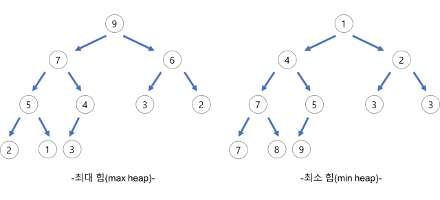
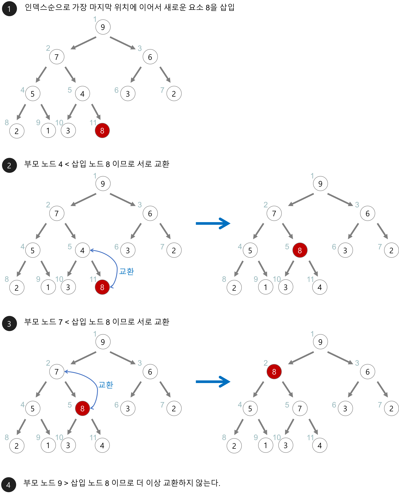

# Heap

## 힙(Heap)

### 힙의 특징

- 완전 이진 트리의 일종, 우선순위 큐를 위해 만들어진 자료구조

- 힙을 이용하여 우선순위 큐를 구현하면 데이터를 삽입, 삭제하는데 O(logN) 소요

- 여러 개의 갑들 중에서 최댓값이나 최솟값을 빠르게 찾아낼 수 있는 자료구조

  - 최대 힙(max heap)은 부모 노드의 키값이 자식노드의 키값 보다 크거나 같은 경우

  - 최소 힙(min heap)을 부모 노드의 키값이 자식노드의 키값 보다 작거나 같은 경우

  - 

- 보통 성능적인 이득을 보기 위해서 배열로 많이 구현

  - 

### 힙의 인덱스

- 구현을 쉽게 하기 위해서 보통 인덱스를 1부터 시작

- 상위 계층의 노드를 부모, 하위 계층의 노드를 자식으로 명명

- 힙의 인덱스는 완전 이진트리와 거의 유사하다.

  - 왼쪽 자식의 인덱스 : (부모의 인덱스) \* 2

  - 오른쪽 자식의 인덱스 : (부모의 인덱스) \* 2 + 1

  - 부모의 인덱스 : (자식의 인덱스) / 2

### 힙의 시간복잡도

- 최대값 또는 최소 값을 찾는데 걸리는 시간은 `O(1)`

- 데이터를 삽입, 삭제 할 때 걸리는 시간은 `O(logN)`

### 힙의 데이터 삽입 삭제 과정

- max heap 기준 설명하며, min heap은 정렬 순서의 차이만 있고 과정은 동일하다.

- 데이터 삽입

  - 

- 데이터 삽입

  - 

### 힙정렬의 의사코드

```
Heapsort(A) {
   BuildHeap(A)
   for i <- length(A) downto 2 {
      exchange A[1] <-> A[i]
      heapsize <- heapsize -1
      Heapify(A, 1)
}


BuildHeap(A) {
   heapsize <- length(A)
   for i <- floor( length/2 ) downto 1
      Heapify(A, i)
}


Heapify(A, i) {
   le <- left(i)
   ri <- right(i)
   if (le<=heapsize) and (A[le]>A[i])
      largest <- le
   else
      largest <- i
   if (ri<=heapsize) and (A[ri]>A[largest])
      largest <- ri
   if (largest != i) {
      exchange A[i] <-> A[largest]
      Heapify(A, largest)
   }
}
```
