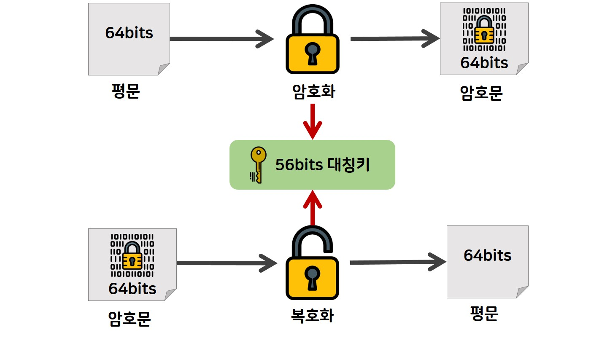

# :books: Symmetric Key & Public Key 대칭키와 공개키

## :bookmark_tabs: 목차

[:arrow_up: **Network**](../README.md)

1. ### [Symmetric Key](#📕-symmetric-key-대칭키) 대칭키
2. ### [Public Key](#📙-public-key-공개키) 공개키

# :closed_book: Symmetric Key 대칭키 암호 알고리즘

## 정의

> 하나의 키로 암호화Encrypt와 복호화Decrypt를 수행하는 대칭 암호 알고리즘

## 특징

- 하나의 키Key로 암호화와 복호화를 모두 수행
- 양방향 암호화이며 암호화에 사용된 키로 복호화 가능한 알고리즘
- 기밀성Confidentiality을 제공

> ### 정보보안의 4원칙
>
> **기밀성(Confidentiality)**
>
> - 인가되지 않은 자는 정보를 확인하지 못하도록 하며, 정보가 유출되더라도 평문으로 해독할 수 없고 변조 또는 위조하지 못하도록 기밀을 유지
>
> **무결성(Integrity)**
>
> - 인가 되지 않은 자로 부터 위조 또는 변조가 발생하지 않았는지 확인
>
> **인증(Authentication)**
>
> - 수신 받은 메시지가 송신자 본인이라는 것을 확인하고 증명
>
> **부인 방지(Non-repudiation)**
>
> - 메시지를 보낸 사람이 보낸 사실을 부인하거나, 받은 사람이 받은 사실을 부인할 경우 증명
>
> 무결성은 모든 암호 알고리즘이 기본적으로 보장하지 않지만 전자 서명Digital Signature을 추가해 무결성을 확보할 수 있음

### 장점

- 키 크기가 상대적으로 작고 암호 알고리즘 내부 구조가 단순
- 비대칭키에 비해 암호화와 복호화 속도가 빠름

### 단점

- 암호 시스템을 사용하는 사용자가 동일한 키를 가지므로 키관리의 어려움
- 디지털 서명 기법에 적용이 힘들고 안전성을 분석하기가 어려움
- 신뢰를 위해 공증을 위한 중재자가 필요

## 암호화 시나리오

1. A와 B는 서로 같은 대칭키를 나누어 가짐
2. A는 사전에 공유된 대칭키로 데이터를 암호화하여 B에게 전송
3. B는 같은 대칭키로 데이터를 복호화

## 대칭키 알고리즘의 종류

### DES(Data Encryption Standard)

- 전 미국 표준 블록 암호
- 64-비트 블록암호이며 56-비트 비밀키를 사용

### AES(Advanced Encryption Standard)

- DES의 안전성 문제가 제기됨에 따라 2000년 미국 표준 블록암호로 채택
- 128-비트 블록암호을 사용하며 128/192/256-비트의 비밀키를 사용

### 아리아(ARIA) & 시드(SEED)

- 1999년 2월 한국인터넷진흥원과 한국의 암호 전문가들이 순수 한국 기술로 개발
- 128-비트 블록암호를 사용

# :orange_book: Public Key 공개키 암호 알고리즘

## 정의

> 암호화Encrypt에 쓰이는 키와 복호화Decrypt를 위한 키가 서로 다른 비대칭 암호 알고리즘

## 특징

- 다른 이름으로는 비대칭키Asymmetric Key 암호 알고리즘
- 대칭키 암호의 키 전달에 있어서 취약점을 해결하고자 등장한 알고리즘
- 양방향 암호화이며 복호화가 가능
- 특정 사람만이 가지는 개인키(또는 비밀키)이고 다른 하나는 누구나 가질 수 있는 공개키의 한쌍으로 구성
- 암호학적으로 연관된 두 개의 키를 만들어서 하나는 자기가 안전하게 보관하고 다른 하나는 상대방에게 공개
- 개인키로 암호화 한 정보는 그 쌍이 되는 공개키로만 복호화가 가능하고, 공개키로 암호화한 정보는 그 쌍이 되는 개인키로만 복호화가 가능
- 기밀성Confidentiality과 인증Authentication, 부인방지Non-repudiation를 제공

### 장점

- 다른 유저와 키를 공유하지 않더라도 암호를 통한 안전한 통신을 할 수 있음
- 키가 분리되어 비밀키를 폐쇠적으로 관리할 수 있어 기밀성이 대칭키에 비해 뛰어남
- 전자 서명이 가능

### 단점

- 키 크기가 비교적 크고 알고리즘을 위한 컴퓨터 자원을 많이 먹음
- 대칭키 시스템에 비해 암호화 복호화 속도가 매우 느림

## 암호화 시나리오

1. A와 B는 비대칭 암호에 사용될 공개키와 비밀키를 생성해 공개키를 배포
2. A가 웹 상에 공개된 B의 공개키를 이용하여 평문을 암호화해 B에게 전송
3. B의 공개키로 암호화된 암호문은 B의 비밀키로만 복호화 가능
4. B는 비밀키 B로 복호화한 평문을 확인하고, A의 공개키로 응답을 암호화해 A에게 전송
5. A는 비밀키 A로 암호화된 응답문을 복호화

> ## 대칭키+공개키 암호화 시나리오
>
> 1. A가 B의 공개키로 암호화 통신에 사용할 대칭키 K를 암호화하여 B에게 전송
> 2. B는 암호문을 받아 자신(B)의 비밀키 B로 복호화
> 3. B는 A로 부터 얻은 대칭키 K로 A에게 보낼 평문을 암호화하여 A에게 전송
> 4. A는 자신의 대칭키 K로 암호문을 복호화
>
> 대칭키를 전송하는데에만 한정적으로 공개키를 사용  
> 이후 대칭키로 암호화 통신을 하면 통신에 필요한 리소스와 속도를 절약할 수 있음  
> = SSL(Secure Socket Layer)의 기초 원리

## 공개키 알고리즘의 종류

### RSA(Rivest, Shamir and Adleman)

- 소인수 분해의 난해함에 기반해 암호학적으로 연관된 두 개의 키를 생성
- 대표적인 공개키 암호 알고리즘으로 거의 대부분 암호화와 인증에 사용
- 암호화뿐만 아니라 전자서명이 가능한 최초의 알고리즘

### ElGamal

- 이산 대수 문제의 어려움에 기반을 둔 최초의 공개키 암호 알고리즘

### ECC(Elliptic Curve Cryptosystem)

- 타원곡선(Elliptic Curve)의 위상적 성질을 이용한 암호 알고리즘

### DSA(SEED)

- 1999년 2월 한국인터넷진흥원과 한국의 암호 전문가들이 순수 한국 기술로 개발
- 128-비트 블록암호
