# :books: CPU Scheduling CPU 스케줄링

## :bookmark_tabs: 목차

[:arrow_up: **Operating System**](../README.md)

1. ### [CPU Scheduler](#📕-cpu-scheduler-cpu-스케줄러)
2. ### [Scheduling Algorithm](#📙-scheduling-algorithm-스케줄링-기법)
3. ### [Scheduler Etc](#📗-scheduler-etc-기타-스케줄러)

# :closed_book: CPU Scheduler CPU 스케줄러

## 정의

> 운영체제가 프로세스에 합리적으로 CPU 자원을 할당하는 정책과 기법

## 스케줄러의 역할

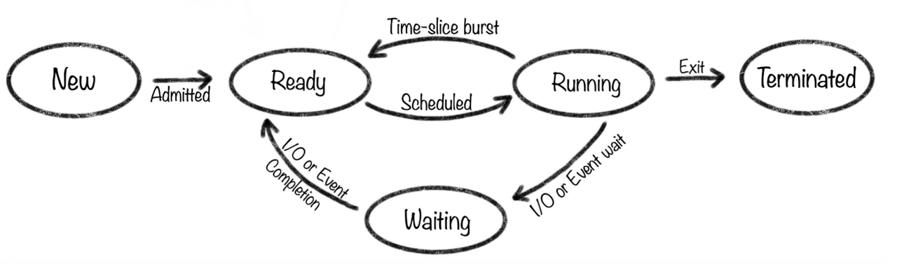

- 다중 프로그램을 실행하기 위해 필요한 것
- 여러 프로세스들이 CPU를 교환하며 보다 생산적으로 동작
- 실행 가능한 여러 프로세스를 준비-실행-대기 과정을 번갈아 반복해 수행

## 스케줄링의 목적

일반적인 시스템에서는 다음과 같은 목적을 공통적으로 지니는 목적

- **No starvation** : 각각의 프로세스들이 오랜시간동안 CPU를 할당받지 못하는 상황이 없도록 함
- **Fairness** : 각각의 프로세스에 공평하게 CPU를 할당
- **Balance** : 시스템의 모든 부분을 균일하게 바쁘도록 유지

## 스케줄링의 단계

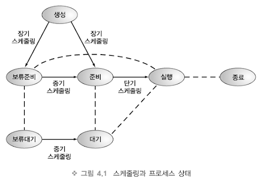

- **장기 스케줄링** : 어느 작업을 커널에 등록시켜 프로세스로 만들어줄지 결정
- **중기 스케줄링** : 보류 상태의 프로세스들 중에서 누구에게 메모리를 할당할지 결정
- **단기 스케줄링** : 준비 상태의 프로세스들 중에서 누구에게 CPU를 할당할지 결정

## 스케줄러의 성능 척도

### 시스템 입장의 성능 척도

- CPU 사용률(CPU Utilization): 전체 시스템 시간 중 CPU가 작업을 처리하는 시간의 비율
- 처리량(Throughput): CPU가 단위 시간당 처리하는 프로세스의 개수

### 사용자 입장의 성능 척도

- 대기시간(Waiting Time): 프로세스가 준비 상태에서 CPU를 할당 받을 때까지 대기 시간
- 응답시간(Response Time): 프로세스의 명령 요청 후 응답이 올 때까지의 시간
- 반환시간(Turnaround Time): 프로세스가 시작해서 끝날 때까지 걸리는 시간

# :orange_book: Scheduling Algorithm 스케줄링 기법

## 스케줄링 결정

- CPU core가 하나라면 한 번에 하나의 프로세스만 실행 가능
- 이때 CPU core를 어떻게 효율적으로 배분할지 결정하는 방법이 스케줄링 기법
- 스케줄러는 같은 목표를 가짐
  - CPU 사용률을 되도록 높게 할 것
  - 주어진 시간에 많은 양을 처리 할 것
  - 준비상태의 프로세스 큐를 적게 유지할 것
  - 응답시간 및 반환시간을 적게 할 것
- 스케줄링 기법은 크게 **비선점형**Non-Preemptive과 **선점형**Preemptive으로 구분

> ### CPU 스케줄러는 언제 스케줄링을 결정하는가?
>
> 아래와 같이 상태에서 다른 상태로 전환Switching이 발생 할 때
>
> 1. Running상태 -> Waiting상태
>    - I/O 요청, 자식프로세스 종료 - wait() 요청을 통해 종료
> 2. Running상태 -> Ready상태
>    - 인터럽트 발생
> 3. Waiting상태 -> Ready상태
>    - I/O 완료
> 4. Running상태 - Terminated상태
>    - 부모프로세스의 종료
>
> 1번과 4번 케이스에서 스케줄링이 발생할 경우 비선점형, 그 이외의 경우 선점형

## 비선점형 스케줄링 Non-Preemptive Scheduling

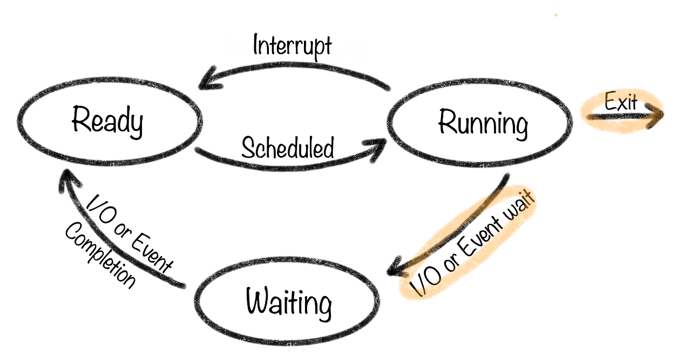

- CPU를 사용 중인 프로세스가 자율적으로 반납하도록 하는 방식
- 어떤 프로세스가 CPU를 점유하고 있다면 이를 뺏을 수 없는 방식
- 강제로 프로세스를 중지하지 않음을 원칙으로 함
- 문맥 교환Context Switching으로 인한 부하가 상대적으로 적음
- 프로세스의 배치에 따라 효율성 차이 크게 발생

> ### Context Switching
>
> 현재 진행하고 있는 작업(Process, Thread)의 상태를 저장하고 다음 진행할 Task의 상태 값을 읽어 적용하는 과정

### FCFS First Come, First Served

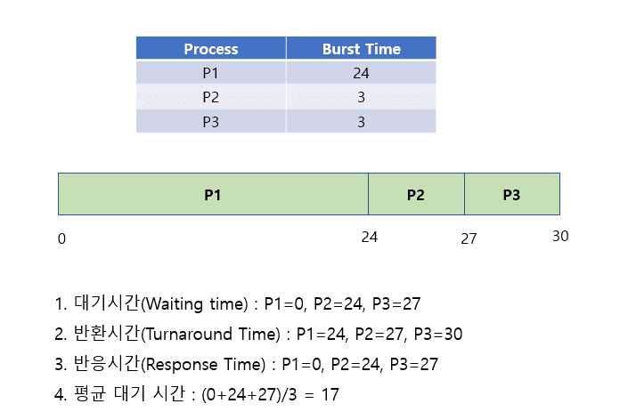

- 가장 먼저 요청한 프로세스에 CPU를 선착순으로 할당해주는 방식
- 호위 효과Convoy Effect가 발생할 수 있음
  - 몇 개의 시간이 오래 걸리는 프로세스로 인해 전체 OS가 느려지는 현상

### SJF Shortest Job First

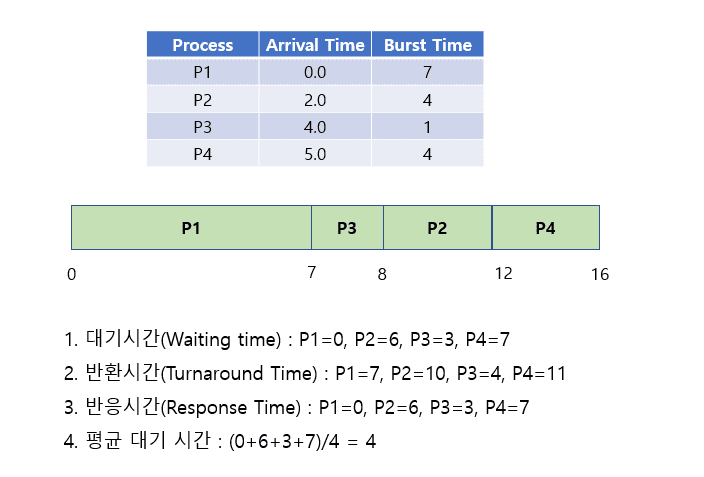

- 실행 시간이 가장 짧은 프로세스를 CPU를 할당해주는 방식
- 하지만 실제로는 프로세스의 CPU 실행 시간을 예측하는 것이 어려움
- 기아 현상Starvation이 발생할 수 있음
  - 긴 시간을 필요로 하는 프로세스가 우선순위가 밀려 무기한 대기하게 되는 현상

### 우선순위 Priority

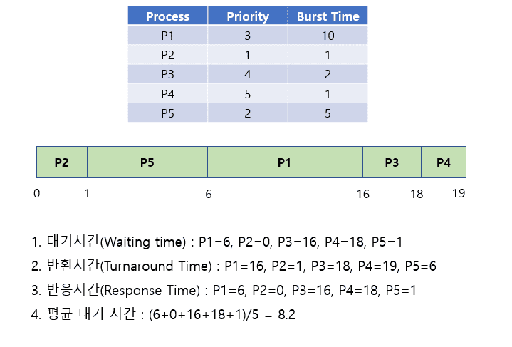

- 각각의 프로세스에 우선순위 넘버를 부여해 CPU를 할당해주는 방식
- 우선순위를 부여해 기아 문제를 방지
  - 실행 중요도에 따라 우선 순위를 부여
  - 긴 시간을 요구하는 프로세스의 순서가 밀리는 노화Aging가 발생
  - 노화가 발생한 프로세스에 우선 순위를 높여 먼저 실행되도록 함

## 선점형 스케줄링 Preemptive Scheduling

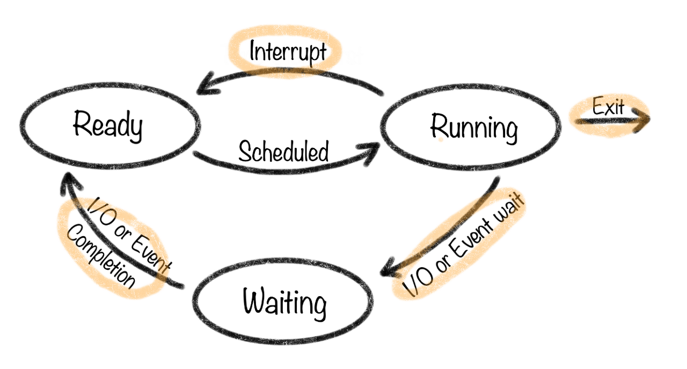

- 현대 운영체제가 사용하고 있는 방식
- 낮은 우선순위의 프로세스보다 높은 우선순위의 프로세스가 CPU를 선점하는 방식
- 어떤 프로세스가 CPU를 점유하고 있어도 운영체제가 강제로 뺏을 수 있는 방식
- 알고리즘에 따라 강제로 중단시키고 다른 프로세스에 CPU를 할당하는 방식
- 처리 시간이 긴 프로세스의 CPU 사용 독점을 막을 수 있어 효율적인 운영이 가능
- 잦은 문맥 교환으로 인한 부하Overhead가 발생

> ### 선점형 스케줄링의 기본 룰
>
> - 높은 우선순위를 가지는 프로세스는 항상 먼저 스케줄되어야 함
> - I/O-bound process는 CPU-bound process 보다 반드시 높은 우선순위에 있어야 함
> - Time slice 의 양은 CPU burst time 보다 조금 더 많아야 함
>   - time slice가 더 적을 경우, 불필요한 context switch가 많이 발생
>   - time slice가 더 클 경우, I/O가 일어날 때에 CPU를 반납하거나 기아 현상 발생
> - Real-time 프로세스는 다른 프로세스에 비해 매우 높은 우선순위를 갖음

### 라운드 로빈 RR, Round Robin

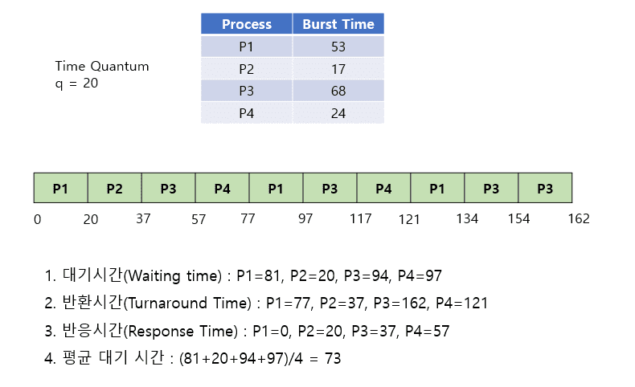

- 현대 컴퓨터에서 사용하는 우선순위 스케줄링 방식
- 각각의 프로세스에 동일한 할당 시간을 부여해서 해당 시간 동안만 CPU를 이용
- 할당 시간 내에 처리를 완료하지 못하면 강제 중단 후 다음 작업으로 넘기는 방식
- 응답 시간을 빠르게 할 수 있음
  - 할당 시간이 길면 FCFS처럼 작동
  - 할당 시간이 너무 짧으면 process sharing으로 작동
    - N개의 프로세스가 균등하게 배치되 CPU 속도의 1/N 씩으로 작동

### SRF Shortest Remaining First

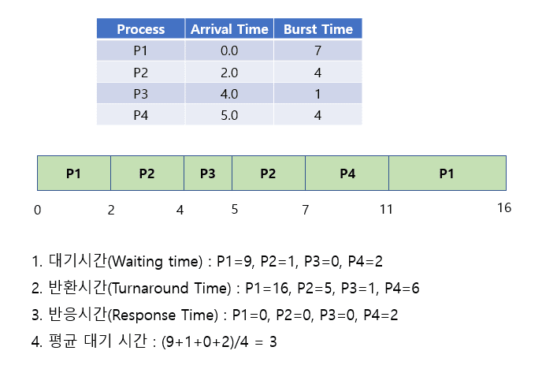

- SRTFShortest Remaining Time First라고도 부름
- SJF와는 달리 현재 실행되고 있는 프로세스의 남은 시간보다 더 빨리 끝날 수 있는 짧은 프로세스가 대기 큐에 들어오면 현재 실행되는 프로세스를 중단하고 짧은 프로세스를 할당하는 방식
- 평균 대기 시간을 줄일 수 있지만 역시 다음 프로세스의 CPU 실행 시간을 예측하는 것이 어렵다는 문제가 있음

### 다단계 큐 Multi-level Queue

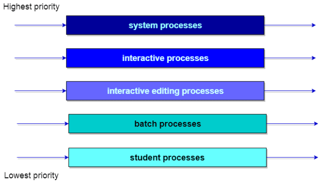

- 우선순위에 따른 준비 큐가 여러 개의 큐들로 나뉘고 각각의 큐는 각자의 스케줄링 기법을 채택하는 방식
- 우선순위가 높은 큐부터 처리되기 때문에 낮은 큐의 프로세스가 처리가 안되는 기아 현상이 나타날 수도 있음
- 각 큐 사이에서 프로세스들이 이동할 수 없어서 유연성이 떨어짐

### 다단계 피드백 큐 Multi-level Feedback Queue

- 다단계 큐의 발전된 형태
- 프로세스가 큐 간의 이동이 가능한 스케줄링 방식
- 노화Aging기법을 채택해 정해진 시간동안 작업을 처리하지 못하면 우선순위가 낮은 큐에 넣어 기아 현상을 방지

# :green_book: Scheduler Etc 기타 스케줄러

## 실시간 스케줄링 Real-time Scheduling

- 실시간 시스템에서의 스케줄링을 위해 사용되는 방법
- 모든 프로세스들이 정해진 마감시한 내에 완료되도록 해야 하는 것이 중요

> ### 실시간 시스템이란?
>
> 실행될 때 모든 프로세스들이 정해진 시간 내에 완료되어야 하는 시스템

### RM Rate Monotinic

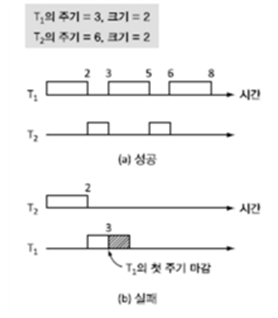

- 대표적인 정적 스케줄링 방식
- 크기와 개수가 알려진 프로세스들이 각자 주기적으로 발생되는 환경에서 사용
- 프로세스의 주기가 짧을수록 높은 우선순위를 받게 되고 선점형으로 스케줄링

### EDF Earliest Deadline First

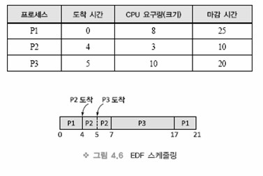

- 프로세스의 마감시한이 가까울수록 우선순위를 높게 부여하는 선점형 동적 스케줄링
- 실행이 완료될 경우에는 마감시한이 가장 가까운 프로세스를 찾아 스케줄링
- 우선순위에 의해 실행 중 CPU를 뺏길 수 있음

## 다중처리 스케줄링 Multiprocessing Scheduling

- 여러개의 CPU를 사용하는 시스템에서의 스케줄링을 위해 사용되는 방법
- 여러 스레드가 병렬로 수행될 수 있으므로 부하 공유Load Sharing 가 가능

> ### 부하 공유Load Sharing
>
> 병렬로 연결된 복수의 CPU에 프로세스를 균등하게 분배함으로써 부하를 줄이고 병렬적으로 가동하는 방법

### 다중처리 스케줄링의 접근 방법

**비대칭 다중 처리** AMP, Asymmetric Multi-processing

- 마스터 서버 Master Server라는 하나의 처리기가 모든 스케줄링 결정과 I/O 처리, 다른 시스템의 활동을 처리
- 그 외 다른 처리기들은 사용자의 코드만 실행

**대칭 다중 처리** SMP, Symmetric Multi-processing

- 다중 처리기를 지원하는 표준 접근 방식
- 각 처리기가 독자적으로 스케줄링을 수행
- 처리기의 스케줄러가 Ready Queue를 검사하고 실행 할 프로세스를 선택해 스케줄링
  - 프로세스들은 공동 Ready Queue에 있거나 각 처리기의 Ready Queue에 존재

### 부하 균등화

- SMP 시스템에서 처리기의 사용을 최대화 하려면 부하를 모든 처리기에 균등하게 배분하는 것이 중요
- Load Balancing은 SMP 시스템의 처리기별 독립적 Ready Queue를 갖고 있는 시스템에서만 필요한 기능
  - 공통 Ready Queue만을 갖고 있는 시스템에서는 처리기가 쉬게 되면 곧바로 다른 프로세스를 선택해 실행하기 때문에 필요하지 않음
- 부하 균등화를 위해 프로세스를 이주하는 방법은 다음과 같음
- **Push 이주** : 특정 태스크가 주기적으로 각 처리기의 부하를 검사하고 부하 불균등 상태라면 덜 바쁜 처리기로 스레드를 이동
- **Pull 이주** : 쉬고 있는 처리기가 바쁜 처리기를 기다리고 있는 프로세스를 pull

### 처리기 선호도

- 프로세스가 처리기에서 실행중일 때 캐시 메모리에는 가장 최근에 접근한 데이터가 처리기의 캐시를 채움\
- 프로세스가 처리기를 이주하게 되면 다음과 같은 상황이 벌어짐
  1. 처리기의 캐시 메모리 내용은 무효화
  2. 처리기의 캐시는 다시 채워져야 함 - 캐시를 무효화하고 다시 채우는 작업은 비용이 많이들기 때문에 SMP 시스템에서는 대부분의 경우 같은 처리기를 이용하게 하는 것이 처리기 선호도

### 다중 코어 프로세서

- 현대 컴퓨터 하드웨어는 동일한 물리적인 칩 안에 여러 개의 처리 코어를 장착
- 각각의 코어는 독립 구조적인 상태를 유지해 OS에서는 개별적인 논리적 CPU로 인식
- 다중코어 프로세서는 스케줄링을 복잡하게 함
- 프로세서가 메모리에 접근할 때 데이터가 가용해질때까지 시간을 허비하는 Memory Stall 현상이 발생
  - 해결하기 위해서 하나의 코어에 2개 이상의 하드웨어 스레드를 할당하는 다중 스레드 프로세스 코어를 구현 (현대 컴퓨터의 1코어 2스레드가 여기서 나옴)
