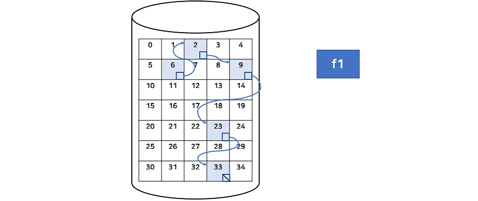

# :books: File Allocation 파일 할당

## :bookmark_tabs: 목차

[:arrow_up: **Operating System**](../README.md)

1. ### [File Allocation](#📕-file-allocation-파일-할당)

# :closed_book: File Allocation 파일 할당

## 정의

> 보조 기억 장치에 데이터를 저장하는 방법

## 특징

- 보조 기억 장치에 데이터를 저장할 땐 여러 개의 섹터를 모아 사용하며, 블록이라 부름
- 디스크의 할당된 블록의 크기는 운영체제마다 다름
- 운영체제에서 각각의 파일을 비어있는 블록Free block에 할당하는 방법으로 크게 3가지
  - **연속 할당 Contiguous Allocation**
  - **연결 할당 Linked Allocation Allocation**
  - **색인 할당 Indexed Allocation**

## 파일 할당의 종류

### 연속 할당 Contiguous Allocation

- 연속된 블록에 파일을 할당하는 방법
- 연속 할당의 장점은 디스크 헤더의 이동을 최소화할 수 있어 I/O 성능을 높일 수 있음
- 주로 동영상, 음악, VOD 등의 시간에 따라 순차적으로 읽어들이는 데이터에 적합
- 순서대로 파일을 읽는 순차 접근Sequential Access이 가능
- 직접 접근Direct Access이 가능
  - 운영체제는 파일의 정보를 디렉토리 테이블에 저장하여 이를 참고할 수 있음
  - 연속 할당은 순차적으로 저장되어 있으므로 운영체제는 디렉토리에서 얻은 시작 블록 번호로 원하는 블록에 바로 접근 가능
  - f1 파일의 3번째 블록에 접근하고 싶다고 가정
    - 운영체제는 f1의 시작 블록 번호가 0번인 것을 알고 있기 때문에 2번 블록에 접근하면 f1의 3번째 블록이라는 바로 알 수 있음
- 연속 할당은 현재에는 거의 사용하지 않는 방식
  - 파일을 할당 및 삭제를 반복하면 중간 중간에 빈 공간Hole이 생기는 문제가 발생
  - 연속 할당은 연속된 공간을 찾아야 하기 때문에 외부 단편화 문제가 발생
  - 파일을 저장할 때 실제 크기를 알 수 없고, 계속해서 사용하는 파일의 경우 크기가 계속 가변하여 연속 할당에 부적합

### 연결 할당 Linked Allocation Allocation

- 연속 할당의 문제를 개선하기 위해 나온 방법
- 링크드 리스트와 같은 방식의 블럭 간의 위치를 참조해 파일을 저장
- 각 블록의 마지막에 주소를 저장하는 포인터가 있으며, 다음 블록의 주소를 가리킴
  - 마지막 블록은 파일의 끝을 나타내는 값을 포인터 공간에 저장
- 새로운 파일을 할당할 때는 비어있는 임의의 블록을 첫 블록으로 선택
  - 만약 파일이 커지는 경우 다른 블록을 할당해서 기존의 블록과 연결
  - 연결 할당은 위치와 상관없이 할당이 가능하므로 외부 단편화 문제가 없음
- 순차 접근은 가능하지만 직접 접근은 불가능
  - 시작 블록 번호를 가지고는 원하는 위치의 블록에 바로 접근 할 수 없음
  - 포인터를 저장하는 영역만큼 데이터 저장 효율에 손해가 발생
- 어떤 요인에 의해 중간 블록의 포인터가 소실되면 이후의 모든 블록에 접근 할 수 없음
- 블록이 흩어져 있으므로 디스크 헤더의 움직임이 많이 발생하여 속도 저하 발생

### FAT File Allocation Table

- 연결 할당의 문제점을 개선하기 위해 등장한 할당 방식
- 다음 블록으르 가리키는 포인터들만 모아서 하나의 테이블을 구성해 블록에 저장
- FAT의 각 인덱스 크기는 전체 블록의 개수를 저장할 만큼 크기를 가짐 (FAT32는 32bit)
- FAT는 매우 중요한 정보이므로 손실 시 복구를 위해 이중 저장
- FAT의 인덱스는 전체 디스크의 블록 번호이며, 각 인덱스마다 다음 블록 번호를 저장
- FAT를 한 번 읽어들여 직접 접근이 가능
- 중간에 소실된 블록 링크가 있어도 다음 블록을 읽을 수 있음
- 메모리 캐싱을 사용하여 블록의 위치를 찾는 논리적 과정은 빠르나 디스크 헤더가 움직이는 물리적 과정은 여전히 느림

### 색인 할당 Indexed Allocation

- Unix/Linux 운영체제에서 주로 사용
- 연결 할당과 같이 데이터를 랜덤한 블록 번호에 할당하나 할당된 포인터를 하나의 블록에 따로 저장하여 인덱스 블록Index Block이라 정의함
- 하나의 파일에는 하나의 인덱스 불록이 매칭됨
- 디렉터리 정보가 시작 블록 번호를 저장하는 것이 아니라 인덱스 블록 번호를 저장
- 인덱스 블록에 할당된 블록을 순서대로 저장하기 때문에 직접 접근이 가능
- 연속적으로 할당할 필요가 없으므로 외부 단편화 문제 또한 발생하지 않음
- 파일 크기와 상관 없이 인덱스 블록을 고정적으로 할당해 때문에 저장 공간에 손실 발생
- 하나의 인덱스 블록이 저장 할 수 있는 양보다 큰 파일을 큰 파일을 저장할 수 없음
  - 해당 문제를 해결하기 위한 방법으로 다음이 있음
  - **Linked**  
    
    인덱스 블록을 여러 개 만들어 연결 할당을 하는 방법으로 각 인덱스 블록의 마지막에 다음 인덱스 블록을 가리키는 포인터가 저장함
  - **Multilevel Index**  
    
    인덱스 블록에 계층을 두는 방법으로 하나의 인덱스 블록의 모든 포인터가 다른 인덱스 블록을 가리키며 이것으로도 부족하면 계층의 깊이를 추가함
  - **Combined**  
    리눅스에서 사용되는 방식으로 Linked와 Multilevel index를 합친 방법으로 한 인덱스 블록의 포인터들은 데이터 블록과 또 다른 인덱스 블록 둘 다 가리킬 수 있음
