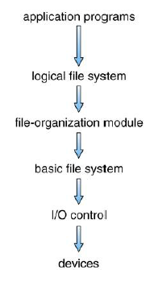

# :books: FileSystem 파일시스템

## :bookmark_tabs: 목차

[:arrow_up: **Operating System**](../README.md)

1. ### [File](#📕-file-파일)
2. ### [FileSystem](#📙-filesystem-파일시스템)

# :closed_book: File 파일

## 정의

> 컴퓨터 저장 장치에서 이름으로 식별되는 데이터를 기록하기 위한 리소스

## 특징

- 보조 기억 장치에 기록되어 있는 정보들의 집합체
- 모든 파일은 0과 1의 비트 패턴Bit Pattern으로 구성됨
- 파일 내부의 정보는 작성자 또는 시스템에 의해 정의됨
- 사용자 관점에서 파일은 논리적 보조 기억 장치에서 파일을 저장하는 최소 할당 단위
- 운영체제는 논리적인 저장 단위Block를 디스크와 같은 물리적인 저장장치에 매핑해 저장
- 파일의 이름은 `{파일이름}.{확장자}`의 형태로 구분
  - ex ) `README.md`
- 운영체제 입장에서 크게 다음과 같은 분류로 파일을 구분
  - **실행 파일** : 운영체제가 메모리로 가져와 CPU를 이용하여 작업을 하는 파일
  - **데이터 파일** : 실행 파일이 작업하는 데 필요한 데이터를 모아놓은 파일

## 파일의 속성

사용자의 편의를 위해 파일에는 이름이 부여되고, 그 이름은 문자열로 구성  
파일 속성은 각 파일 헤더에 기록되며, 운영체제는 이러한 파일 헤더를 파일 테이블로 관리

- **파일 헤더** : 파일 테이블에서 관리하며 일반적인 내용
- **고유 헤더** : 파일의 버전 번호, 크기 등 응용 프로그램이 필요로 하는 정보

파일의 구성은 운영체제마다 구현체가 상이하나 대부분 다음과 같은 보편적인 요소를 포함

- **이름 Name** : 사람이 읽을 수 있는 형태로 유지된 기호형 파일 이름
- **식별자 Identifier** : 보통 숫자로 파일 시스템 내에서 파일을 확인. 파일의 이름은 인간이 읽을 수 없는 형식
- **종류 Type** : 다른 종류의 파일들을 지원하는 시스템에 요구되는 정보들을 포함
- **위치 Location** : 장치와 장치의 파일 위치를 가리키는 포인터에 대한 정보
- **크기 Size** : 파일의 현재 크기와 최대 허용 크기가 이 속성에 포함
- **보호 Protection** : 접근 제어 정보는 읽기, 쓰기, 실행 등등을 할 수 있는 사용자를 결정
- **타임스탬프와 사용자 식별 Timestamps and user identification** : 생성, 마지막 수정, 마지막 사용에 관한 정보. 이 데이터들은 보호, 보안, 그리고 사용 모니터링에 활용됨

## 파일의 구조

파일은 하나의 데이터 덩어리이며 파이 구조는 이 데이터 덩어리를 어떻게 구성하느냐에 따라 순차 파일 구조, 인덱스 파일 구조, 직접 파일 구조로 구분

1. **순차 파일 구조**

   - 일반 파일은 기본적으로 순차 파일 구조
   - 순차 파일 구조는 파일 내용이 하나의 긴 줄로 늘어선 형태
   - 파일을 작업할 때, 앞에서부터 뒤까지 순차적인 접근만 가능
   - 순차구조로 공간 낭비가 없고 구조가 단순해 순서대로 읽거나 저장할 때 빠름
   - 새로운 데이터의 삽입 및 삭제가 느리고 특정 데이터로 직접 접근이 어려움

2. **인덱스 파일 구조**

   - 순차 파일 구조의 단점을 해결한 파일 구조
   - 순차 파일 구조에 인덱스 테이블을 추가하여 순차 접근과 직접 접근이 가능

3. **직접 파일 구조**
   - 데이터의 특정 값에 관계를 정의하여 물리적인 주소로 바로 변환하는 파일 구조
   - 데이터 접근이 매우 빠르지만 해시 함수의 선정이 매우 중요 (해시 충돌)

# :orange_book: FileSystem 파일시스템

## 정의

> 파일의 실제 데이터와 메타데이터를 저장및 관리하는 체계

> 파일에 이름을 붙이고, 저장이나 검색을 위해 논리적으로 어디에 위치시켜야 하는지 등을 나타내는 방법 및 시스템

## 특징

- 파일과 파일의 집합체인 디렉터리를 관리
  - UNIX에선 Directory, Widows에선 Folder라고 부름
- 파일 및 디렉터리의 생성, 수정, 삭제, 색인, 탐색을 지원
- 파일 및 디렉터리에 대한 접근 방법을 제공하고 권한이 없는 사용자의 접근을 차단
- 파일 내용이 손상되지 않도록 하는 무결성을 보장
- 파일의 암호활르 지원해 악의적인 접근으로부터 차단

## 파일 시스템의 구조

파일시스템의 일반적인 구조는 다음과 같은 레이어의 집합으로 구성

1. **I/O Control**
   - Device Driver & Interrupt Handler가 담당해준다

파일의 실제 위치를 input으로 받는다

2. **Basic File System**

   - 내부적으로 Cache와 같은 Buffer가 존재
   - 매번 I/O Control까지 내려가서 Interrupt를 하면 속도가 느리기에 Buffer를 도입
     - Buffer에 Request Data가 존재하면 Buffer 내용을 그대로 전달
     - Buffer에 Request Data가 없으면 I/O Control로 내려가서 Device Driver와 연동해서 파일로부터 데이터를 받음

3. **File-Organizaton Module**

   - Logical File Blocks - Physical File Blocks간의 Mapping 정보를 관리
   - 파일 시스템상에 Free Space를 관리

4. **Logical File System**
   - 파일 시스템이 필요로 하는 모든 메타데이터를 FCB에 저장해서 관리
     - File Description을 저장해서 관리
       - name / ownership / permissions
       - Reference Count / Time Stamps / Pointer to other FCBs
       - Pointer to data blocks on disk
   - 파일 구조와 디렉토리 구조를 저장해서 관리

## 파일 시스템의 빈 공간 관리

- 파일 시스템은 빈 블록의 정보만 모아놓은 빈 공간 리스트 Free Block List를 유지
- 빈 공간 리스트로 보내지면 내용은 지워지지 않고 빈 공간 리스트에 삽입
- 새로운 블록을 할당할 때는 리스트에 먼저 들어온 블록부터 할당
  - 아직 할당되지 않았다면 디스크 복구나 휴지통에서 삭제한 파일을 되살릴 수 있음
  - 더미파일로 디스크를 전부 덮어씌우는 방법으로 복구 불가 상태로 만들 수 있음
