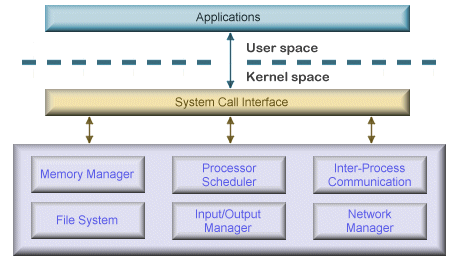

# :books: Kernel & System Call 커널과 시스템콜

## :bookmark_tabs: 목차

[:arrow_up: **Operating System**](../README.md)

1. ### [Kernel](#📕-kernel-커널)
2. ### [System Call](#📙-system-call-시스템-콜)

# :closed_book: Kernel 커널

## 정의

> 프로세스 관리, 메모리 관리, 저장장치 관리와 같은 운영체제의 핵심 서비스를 제어하는 코드를 모아놓은 기능 집합

## 커널의 역할

- 커널은 인터페이스와 드라이버를 제외한 운영체제의 영역
- 운영체제 중 메모리에 항상 상주하는 필수 기능 집합
- 기존의 운영체제의 핵심 역할을 커널이 담당
  - 자원 관리
  - 자원 보호
  - 인터페이스 제공

## 커널의 구성

### 단일형 구조 커널

- 단일형 구조커널은 초창기의 운영체제에 사용된 구조
- 커널의 핵심 기능을 구현하는 모듈들이 구분 없이 하나로 구성
- 장점
  - 모듈이 분리되지 않았기 때문에 모듈 간의 통신 비용이 적어 효율적
- 단점
  - 모든 모듈이 하나로 묶여 있기 때문에 버그나 오류 처리하기 어려움
  - 서로 연결되어 있어 상호 의존성이 높아 작은 결함이 시스템 전체 성능 문제와 직결
  - 다양한 하드웨어 환경에 시스템 적용이 어려움

### 계층형 구조 커널

- 단일형 커널이 발전된 형태로 현재의 운영체제에서 사용되는 구조
- 비슷한 기능을 가진 모듈을 묶어서 하나의 계층으로 구성
- 계층 간의 통신을 통해 운영체제를 구동
- 단일형 구조 커널의 단점을 개선
  - 모듈화로 인한 버그 및 오류 수정이 용이
- 계층으로 구성되어 한 계층에 문제가 발생하면 다른 계층도 영향을 받음
- 기능의 추가로 계층이 많아지면 복잡성이 증가하고 하드웨어 요구 용량 증가

### 마이크로 구조 커널

- 계층형 커널의 방대해진 구조를 개선한 형태로 모바일 운영체제에 사용되는 구조
- 프로세스 관리, 메모리 관리, 프로세스간 통신 등의 가장 기본적인 기능만 제공
- 그 밖의 기능은 사용자 영역에 구현된 모듈로 정의
- 모듈을 추가 및 제거, 수정 하는 것으로 기능 세분화
- 필요한 기능의 모듈만 활용해 다양한 하드웨어 환경에 적용 가능
- 모든 모듈이 독립적으로 존재하므로 모듈 간 통신이 비용이 비싸 성능저하

## 이중 모드

- CPU는 사용자나 프로그램이 시스템을 손상하는 것을 방지하기 위해 2가지 모드를 제공
- CPU의 플래그 레지스터 중 슈퍼바이저 플래그 `Mode Bit`로 모드를 구분
  - `0`은 커널모드Kernel Mode
  - `1`은 사용자모드User Mode
- 파일 읽기 및 쓰기, 혹은 화면에 메세지를 출력하는 등 많은 부분이 커널 모드를 사용

### 사용자모드 User Mode

- 사용자 및 프로그램의 코드가 실행되는 모드
- 커널 영역의 코드를 실행할 수 없기에 하드웨어 자원에 접근하는 명령을 실행할 수 없음
- 하드웨어 접근을 위해서는 시스템 콜System Call을 사용해 커널 모드를 호출

### 커널모드 Kernel Mode

- 운영체제에서 CPU를 사용하는 모드
- 시스템 콜을 통해 커널모드로 전환이 되면 운영체제는 하드웨어를 제어하는 명령어Privileged Instructions를 실행
- 하드웨어 제어 명령어는 사용자 모드에서 실행되면 Exception이 발생

# :orange_book: System Call 시스템 콜

## 정의

> 사용자나 프로그램이 커널 영역Kernel Space에 접근하기 위한 시스템 인터페이스

## 시스템 콜의 역할

- 커널 영역의 기능을 사용자 모드에서 사용 가능하게 커널 모드를 호출하는 기능
- 시스템콜을 직접 요청하기보다 시스템 콜을 요청하는 라이브러리 함수 API를 사용

## 시스템 콜의 동작

- `opne()` 시스템 콜을 호출 했을때 처리과정
  
- 시스템 콜에 다양한 매개정보를 포함하고 있을때 처리과정
  
  1. 매개변수를 CPU 레지스터 내에 전달
  2. 매개변수의 갯수가 CPU 내의 총 레지스터 개수보다 많은 경우
     - 매개변수를 메모리에 저장하고 메모리의 주소가 레지스터에 전달
     - 매개변수는 프로그램에 의해 스택(stack)으로 전달(push) 될 수 있음

## 시스템 콜의 종류

UNIX 명령어 기준으로 정리하고, 그에 대응되는 Widows 명령어는 상기 이미지 참고

### 1. 프로세스 제어 Process Control

- 끝내기(exit), 중지 (abort)
- 적재(load), 실행(execute)
- 프로세스 생성(create process) - fork
- 프로세스 속성 획득과 속성 설정
- 시간 대기 (wait time)
- 사건 대기 (wait event)
- 사건을 알림 (signal event)
- 메모리 할당 및 해제

### 2. 파일 조작 File Manipulation

- 파일 생성 / 삭제 (create, delete)
- 열기 / 닫기 / 읽기 / 쓰기 (open, close, read, wirte)
- 위치 변경 (reposition)
- 파일 속성 획득 및 설정 (get file attribute, set file attribute)

### 3. 장치 관리 Device Manipulation

- 하드웨어의 제어와 상태 정보를 얻음 (ioctl)
- 장치를 요구(request device), 장치를 방출 (relese device)
- 읽기 (read), 쓰기(write), 위치 변경
- 장치 속성 획득 및 설정
- 장치의 논리적 부착 및 분리

### 4. 정보 유지 Information Maintenance

- getpid(), alarm(), sleep()
- 시간과 날짜의 설정과 획득 (time)
- 시스템 데이터의 설정과 획득 (date)
- 프로세스 파일, 장치 속성의 획득 및 설정

### 5. 통신 Communication

- pipe(), shm_open(), mmap()
- 통신 연결의 생성, 제거
- 메시지의 송신, 수신
- 상태 정보 전달
- 원격 장치의 부착 및 분리

### 6. 보호 Protection

- chmod()
- umask()
- chown()
