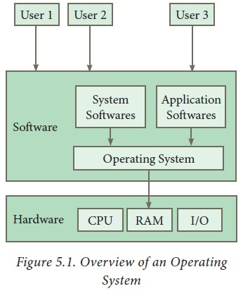
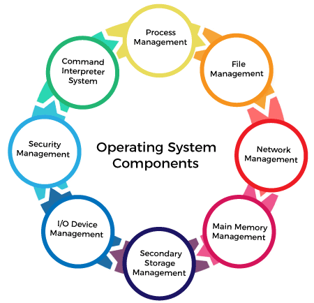

# :books: Operating System 운영체제

## :bookmark_tabs: 목차

[:arrow_up: **Operating System**](../README.md)

1. ### [Operating System](#📕-operating-system-운영체제)

# :closed_book: Operating System 운영체제

## 정의

> 운영체제Operating System이란 컴퓨터 시스템의 하드웨어, 소프트웨어적인 자원들을 효율적으로 운영 및 관리함으로써 사용자가 컴퓨터를 편리하고 효과적으로 사용할 수 있도록 하는 시스템 소프트웨어

## 운영체제의 역할

### 자원 관리

- 컴퓨터 이용에 필요한 입출력 자원(키보드, 네트워크, 사운드, 모니터 등)은 한정적
- 운영체제는 적당한 순서로 자원을 배분하고 적절한 시점에 자원을 회수하여 다른 응용프로그램들에게 나누어주는 역할을 담당

### 자원 보호

- 이용자나 응용프로그램의 미숙 및 악의로 인한 자원 손해를 방지하는 역할

### 인터페이스 제공

- 하드웨어 인터페이스를 제공해 하드웨어의 종류에 상관없이 사용할 수 있도록 함
- 사용자 인터페이스를 제공해 사용자가 컴퓨터를 사용하는데 더 편리하도록 지원

## 운영체제의 목표

|  목표  |           역할           |
| :----: | :----------------------: |
| 효율성 |         자원관리         |
| 안정성 |         자원보호         |
| 확장성 | 하드웨어 인터페이스 제공 |
| 편리성 |  사용자 인터페이스 제공  |

### 효율성

- 컴퓨터 자원의 효율적 관리를 목표로 함
- 한정적인 같은 자원을 사용하여 더많은 작업량을 처리
- 같은 작업량을 처리하는 데 보다 적은 자원을 사용

### 안정성

- 사용자의 안정적인 작업을 위한 보안 제공을 목표로 함
- 사용자와 응용프로그램의 안전 문제와 하드웨어적인 보안 문제를 처리
- 시스템에 문제가 발생했을 때 이전으로 복구하는 결함 포용(fault tolerant) 기능을 수행

### 확장성

- 다양한 시스템 자원을 추가 또는 제거가 편리함을 목표로 함
- 하드웨어의 종류에 상관없이 설치와 실행이 되는 플러그 앤드 플레이Plug and Play 제공
- 앞으로 개발될 새로운 하드웨어도 제약없이 사용할 수 있도록 확장성을 보장
- 이를 위해 사용자의 편리성뿐만 아니라 하드웨어 제작자의 편리성도 고려해 설계

### 편리성

- 사용자가 편리하게 작업할 수 있는 환경을 제공하는 것을 목표로 함
- 사용자의 편의성과 효율성은 서로 반비례 관계
- 편의성을 위해 컴퓨터 자원을 낭비하지 않도록 적절한 정도를 조절 및 방지

## 운영체제의 기능

- **프로세스 관리** : OS에서 동시에 실행되는 많은 프로세스를 효율적으로 관리
- **파일 관리** : 파일 생성, 수정, 삭제, 조작, 백업 등등
- **네트워크 관리** : 네트워크 서비스 성능, 오류분석, 프로비저닝, 품질관리 등등
- **메인 메모리 관리** : 메모리 추적, 프로세스에 따른 메모리 할당
- **보조 스토리지 관리** : 스토리지 할당, 여유 광간 관리, 디스크 스케줄링
- **입출력 장치 관리** : 버퍼 캐싱 시스템 제공, 장치 드라이버 제공
- **보안 관리** : 시스템 보호 및 오류로 인한 시스템 손상 방지
- **명령어 해석 시스템** : 사용자와 시스템 간의 인터페이스. 인터프리터, 쉘 등등

## 운영체제의 구조

- 운영체제의 구성요소는 크게 커널과 인터페이스, 시스템 콜과 드라이버 구성

### 커널(Kernel)

- 커널은 '핵심'을 의미
- 운영체제 커널이라고 하면, 운영체제가 동작하는 전반적인 프로세스를 의미
- 주로 자원 관리와 관련된 내용을 담당
  - CPU 스케줄링과 프로세스 관리
  - 메모리 관리
  - 디스크 파일 관리
  - I/O 디바이스 관리

### 인터페이스(Interface)

- 사용자의 명령을 컴퓨터에 전달하고 결과를 사용자에게 알려주는 소통 방법을 의미
- 크게 **GUI**Graphical User Interface와 **CLI**Command Line Interface로 구분
  - **GUI** : 그래픽으로 이루어져 마우스와 같은 포인터 장치로 지정된 좌표에 존재하는 아이콘 또는 버튼과 상호작용하는 방식의 인터페이스
  - **CLI** : 콘솔 또는 쉘, 터미널로 불리는 명령줄Command Line을 입력할 수 있는 화면에 키보드로 명령줄을 입력해서 상호작용하는 방식의 인터페이스

### 시스템 콜(System Call)

- 사용자나 프로그램이 커널 영역Kernel Space에 접근하기 위한 인터페이스
- 커널에 접근하기 위해선 시스템 콜 함수를 사용해야함
- 사용자나 프로그램이 컴퓨터 자원에 직접 접근하는 것을 막고 커널을 보호

### 드라이버(Driver)

- 하드웨어 장치와 운영체제 간의 통신을 가능하게 하는 소프트웨어
- 특수한 목적을 가진 하드웨어와 통신하는 방법을 정의한 함수 집합
- 운영체제가 다양한 하드웨어에 대응하는 코드를 내장하기 어렵기 때문에 제작
  - 운영체제(커널)은 기초적인 입출력 입력과 관련된 시스템 콜만 제공
- 프린터, 키보드 및 디스크 드라이브와 같은 하드웨어 장비의 실행에 필요

## 운영체제의 유형

### 일괄처리 시스템 Batch processing system

- 유사한 작업들끼리 일정량 또는 일정 시간 묶어서 처리하는 방식
- 컴퓨터 시스템을 효율적으로 사용할 수 있지만 하나의 작업이 모든 자원을 독점하므로 CPU 유휴 시간이 줄어듦
- ex) 초기 Punch Card 처리 시스템, ORM카드 등등

### 다중 프로그래밍 시스템 Multi programming system

- 하나의 CPU와 주기억 장치를 이용하여 여러 개의 프로그램을 동시에 처리하는 방식
- CPU와 대화하면서 처리가 가능하여 CPU 사용률과 처리량이 증가

### 시분할 시스템 Time sharing system

- 시간을 분할하여 여러 사용자들에게 컴퓨터 자원을 번갈아가며 할당하는 방식
- 사용자는 자신이 컴퓨터를 독점하고 있다는 느낌을 받음

### 실시간 시스템 Real-Time system

- 단말기의 요청을 즉시 처리하여 결과를 반환하는 시스템
- ex) 원자로 / 공장 제어, 미사일, 반도체 장비, 로봇 제어

### 다중처리 시스템 Multi-processing system

- 여러 CPU와 하나의 주기억장치를 이용해 여러 개의 프로그램을 동시에 처리하는 방식
- 단일 운영체제에 의해 관리되며, 하나의 CPU가 고장나도 시스템의 신뢰성과 안정성을 보장할 수 있음

### 분산 컴퓨팅 Distributed computing

- 넷상으로 연결된 여러 대의 컴퓨터들의 처리 능력을 이용하여 복잡한 계산 문제를 해결하려는 분산 처리 모델
