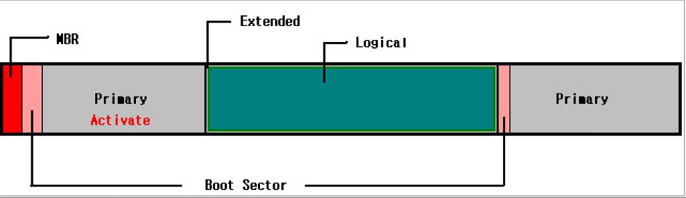
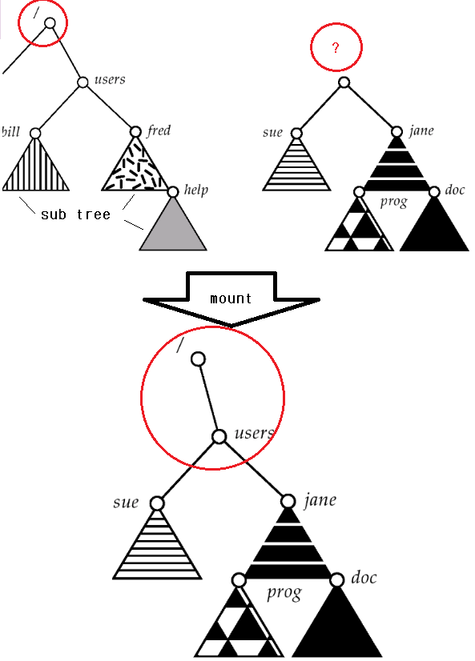

# :books: Partition & Mount 파티션과 마운트

## :bookmark_tabs: 목차

[:arrow_up: **Operating System**](../README.md)

1. ### [Partition](#📕-partition-파티션)
2. ### [Mount](#📙-mount-마운트)

# :closed_book: Partition 파티션

## 정의

> 보조 기억 장치에 하나 이상의 영역을 생성하여 별도로 관리할 수 있도록 하는 디스크 파티셔닝 Disk Partitioning의 결과물로 생성된 저장 영역

## 특징

- 하나의 물리적인 보조 기억 장치에 별도의 논리적인 영역을 구분하여 데이터를 관리
- 파티션의 종류는 크게 두 종류로 구분
  - 운영체제 등이 설치되어 기능을 수행하는 주파티션Primary
  - 데이터를 구분해 저장하기 위한 논리적으로 분리된 파티션Logical

## 파티션의 종류

### 1. MBR Master Boot Recoder

- 하드에서 가장 먼저 읽히는 부분
- 하드디스크의 전체적인 관리를 담당하는 부분으로 다른 파티션에 대한 정보를 담음
- 최대 4개의 파티션을 관리할 수 있음

> 최대 나눌 수 있는 파티션은 주파티션 3 + 확장파티션(논리 4개) = 7개

- 주파티션마다 각각의 부트섹터BootSector가 할당되며, 컴퓨터가 어느곳의 부트섹터를 읽어서 부팅을 해야하는지 알 수 없음
- 따라서 운영체제를 설치하게 되면 하드에서 가장 먼저 읽히는 MBR에 자신의 부트레코더BootRecoder를 기록하여 자기가 실행되게 만듬

### 2. 주파티션 Primary

- 파티션 앞에 부트섹터BootSector가 할당되어서 운영체제를 설치 할 수 있음

### 2-1. 활성 주파티션 Activate Primary

- MBR에 부트 레코더가 기록된 파티션
- 활성 주파티션은 하나만 설정 할 수 있음
- 여러개의 주파티션에 개별 운영체제를 설치했을 때 각각 기록된 부트레코드를 가짐
- 이 중 하나를 MBR에 적재하여 컴퓨터의 최초 부팅시 적재된 부트레코드를 통해 해당하는 운영체제를 실행

### 3. 확장파티션 Extended

- 논리드라이브(Logical)를 구분하기 위한 영역
- 확장파티션은 하나의 물리디스크에 하나만 설정
- 최대 4개의 논리드라이브를 설정 할 수 있으며, 논리드라이브에 대한 정보를 담음

### 4. 논리드라이브 Logical

- 데이터를 저장할 수 있는 드라이브
- 부트섹터가 없으므로 운영체제는 설치할 수 없음

# :orange_book: Mount 마운트

## 정의

> 운영 체제에서 사용자가 컴퓨터의 파일 시스템을 통해 액세스할 수 있도록 저장 장치에 있는 파일 및 디렉터리를 만드는 과정

## 특징

- 운영체제에서 저장 장치 안의 파일에 접근하기 위해 필수적으로 이루어져야 하는 과정
- 새로 마운트된 매체가 등록된 VFS의 위치를 마운트 지점이라 함
- 다음 과정을 거쳐 마운팅Mounting이 발생
  - 운영체제가 저장 매체에 대한 엑세스 권한을 획득
  - 파일 시스템 구조와 메타데이터을 인식 및 처리
  - 처리 결과를 가상파일시스템VFS 구성요소에 등록
- 마운트의 반대 프로세스를 마운트 해제라 하며 다음 과정을 거침
  - 운영체제가 마운트 지점의 파일 및 디렉터리에 대한 사용자 엑세스를 차단
  - 사용자 데이터와 나머지 대기열을 저장 장치에 기록
  - 파일 시스템의 메타데이터를 수정하고 마운트 지점의 엑세스를 해제

## 파일 마운팅File Mounting

1. 운영체제에게 장치 이름과 파일 시스템을 부착 할 수 있는 파일 구조 내의 위치를 제공
   - 일반적으로 마운트 지점은 장착되는 파일 시스템이 부착될 비어있는 디렉토리
2. 운영체제는 장치가 유효한 파일 시스템을 포함하는지 확인
   - 장치 드라이버가 장치 디렉토리를 읽고 디렉토리가 유효한 포맷을 가지고 있는지 확인하도록 요청
3. 운영체제는 파일 시스템이 지정된 마운트 지점에 장착되었음을 디렉토리 구조에 기록
   - 운영체제가 디렉토리 구조를 순회하고 파일 시스템을 적절히 교체할 수 있도록 함
