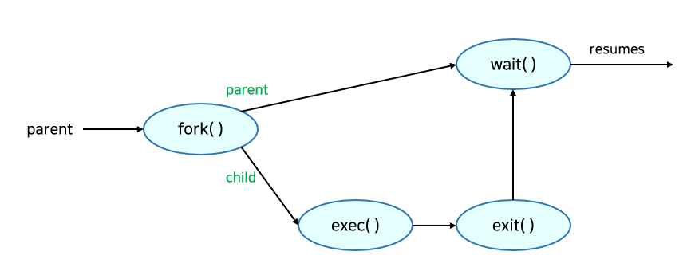

# :books: Process <sub>프로세스</sub>

## :bookmark_tabs: 목차

[:arrow_up: **Operating System**](../README.md)

1. ### [Process](#📕-process-프로세스)
2. ### [PCB & Context Switch](#📙-pcb--context-switch)
3. ### [Process Scheduling & Management](#📗-scheduling--management-스케줄링과-매니지먼트)
<!-- 4. ### [Cooperating Processes](#) -->

# :closed_book: Process <sub>프로세스</sub>

## 정의

> 컴퓨터에서 실행되고 있는 프로그램으로 운영체제로부터 자원을 할당받아 실행하는 작업의 단위

> **프로그램과 프로세스 차이**
>
> - **프로그램** : 하드 디스크 등에 저장되어 있는 실행코드
> - **프로세스** : 프로그램을 구동할 때 프로그램과 그 상태가 메모리 상에서 실행되는 작업 단위
> - 프로세스는 프로그램 실행의 복사본으로 한 컴퓨터에 여러개 존재할 수 있음

## 프로세스의 구조

- 프로세스는 최소 하나의 스레드<sub>Thread</sub>를 포함하고 있으며, 스레드 단위로 스케줄링을 진행
- 프로세스는 스택<sub>Stack</sub> , 힙<sub>Heap</sub> , 데이터<sub>Data</sub> , 코드<sub>Code</sub>로 구성
- 프로세스는 프로세스 문맥<sub>Process Context</sub>으로 표현 가능
  
  - 하드웨어 문맥<sub>Process Context</sub> : Program Counter, Register
  - 주소공간<sub>Address Space</sub>
  - PCB<sub>Process Control Block</sub>
  - 프로세스 커널 스택<sub>Process Kernel Stack</sub>

## 프로세스의 상태


1. **New** : 프로세스가 처음 생성된 상태
   - 프로세스를 생성하고 있는 단계로 커널 공간에 PCB가 만들어진 상태
2. **Ready** : 프로세스가 CPU에 할당되기를 기다리는 상태
   - 프로세스가 메모리에 적재된 상태로 실행하는데 필요한 자원을 모두 얻은 상태
   - 아직 CPU를 받지는 않았지만 CPU를 할당받으면 바로 실행 가능한 상태
   - Ready 상태의 프로세스가 동시에 여러개 존재할 수 있음
3. **Running** : 프로세스가 할당되어 CPU를 잡고 명령을 수행 중인 상태
   - 일반적으로 CPU의 개수에 비해 대기중인 프로세스가 많음
   - 따라서 여러 프로세스가 동시에 실행돼도 실제로 실행 중인 프로세스는 매 시점 CPU당 하나
4. **Waiting** : 프로세스가 어떠한 이벤트가 발생하기를 기다리는 상태(할당해도 수행할 수 없는 상태)
   - Blocked 라고 부르기도 함
   - 주로 프로세스가 I/O 작업 등을 을 처리 중 상태가 대표적
   - 디스크 I/O 작업은 CPU 처리 속도에 비해 오래걸려 I/O 작업이 점유 중일때 CPU 낭비가 발생
     1. 디스크 I/O 작업을 하는 프로세스 A는 CPU를 반납하고 장치 큐로 이동(Blocked)
     2. 디스크 컨트롤러가 일을 수행하고 데이터를 로컬 버퍼로 불러오면 CPU에게 알림(Interrupt)
     3. 장치 큐에서 프로세스 A를 준비 큐로 옮기고 CPU 할당과 로컬 버퍼 데이터를 메모리에 올림
5. **Terminated** : 프로세스가 실행을 마쳤을 때로, 아직 완전히 프로세스가 제거되진 않은 상태
   - 할당된 CPU는 반납했지만 커널 공간 내의 PCB는 남아 있음
6. **Suspended** : 프로세스가 메모리를 강제로 뺏긴 중지 상태로 특정한 이유로 프로세스의 수행이 정지됨
   - 외부에서 다시 재개시키지 않는 한 활성화 되지 않음
   - 중기 스케줄러에 의해 디스크로 스왑 아웃된 상태가 대표적
   - 하위 상태로 Suspended Ready와 Suspended Blocked가 있음
     - Suspended Ready : 준비 상태에 있던 프로세스가 디스크로 스왑 아웃
     - Suspended Blocked : 봉쇄 상태에 있던 프로세스가 디스크로 스왑 아웃

> **Waiting과 Suspended 차이**
>
> - **Waiting** : 잠시 중지되어있다 끝나면 다시 ready 상태로 돌아옴(능동적)
> - **Suspended** : 잠시 중지되어있다 누군가가 재개시켜줘야 다시 ready 상태로 돌아옴(수동적)

# :orange_book: PCB & Context Switch

## PBC <sub>Process Control Block</sub>

> 운영체제가 각 프로세스를 관리하기 위해 커널에 생성한 각 프로세스 별 정보 자료 구조

- CPU에서는 프로세스의 상태에 따라 문맥 교환<sub>Context Switching</sub>이 발생
- 교체된 프로세스의 상태를 저장해뒀다 다시 수행시 사용할 값을 복원하기 위함


- 운영체제가 관리에 사용하는 정보
  - PID, Process ID : 프로세스 식별용 고유 번호
  - Process state : 현재 프로세스의 상태를 기록하는 값
  - Scheduling information : 스케줄링 파라미터 (프로세스의 중요도, 스케줄링 큐 포인터 등)
  - Priority : 프로세스의 우선순위
- CPU 수행 관련 하드웨어 값
  - CPU 스케줄링 정보 정보 : 프로세스가 언제 어떤 순서로 CPU에 할당 받을지의 정보를 기록
  - Program counter : 해당 프로세스가 이어서 실행해야 할 명령의 주소를 가리키는 포인터
  - Register : 프로세스가 인터럽트 이후 작업을 이어가기 위해 참조하는 CPU 레지스터에 저장된 값
    - 프로세스는 자신의 차례에 할당되면 이전에 사용했던 레지스터의 진행값을 모두 복원 함
- 메모리 관련
  - Page Table : 프로세스가 어느 주소에 저장되어 있는지 정보
  - Code, Data, Stack의 위치 정보, base/limit 레지스터 값
- 파일 관련
  - I/O 장치 목록 : 어떤 I/O 장치가 할당 됐는지 기록
  - open file descriptors : 열린 파일 목록과 참조를 기록

## Context switching <sub>문맥 교환</sub>

> 프로세스가 실행되다가 인터럽트가 발생해 CPU를 한 프로세스에서 다른 프로세스로 넘겨주는 과정


> **Context**
>
> - 하나의 프로세스 수행을 재개하기 위해 기억해야 할 정보
> - 해당 프로세스의 PCB의 형태로 저장되어 있음

- 운영체제는 CPU를 내어주는 프로세스의 상태를 그 프로세스의 PCB에 저장
- CPU를 새롭게 얻는 프로세스의 상태를 PCB에서 읽음
- CPU 입장에서 Context는 PCB, 따라서 PCB 정보가 바뀌는 것이 Context Switch
- 시스템 콜이나 인터럽트가 발생 시 문맥교환이 이루어지는게 아니며 Process to Process 전환 시에 교환
- 수많은 프로세스의 문맥 교환이 일어난다고 생각하면 Overhead가 심함
  - 캐시 메모리 초기화 등 무거운 작업이 진행되며 많은 시간과 자원을 소모 -> Thread를 활용

# :green_book: Scheduling & Management <sub>스케줄링과 매니지먼트</sub>

## Process Scheduling

> 어떤 프로세스를 프로세서에 할당할 것인가를 결정하는 일

- 프로세서가 하나인 시스템은 오직 하나의 running 프로세스를 가짐
- 여러 프로세스가 존재하는 경우 나머지는 CPU가 free 상태가 될 때까지 대기
- 멀티프로그래밍<sub>Multiprogramming</sub>은 CPU를 최대한 사용하기 위해 몇몇 프로세스를 항상 실행시키는 것
- 시간 공유<sub>Time Sharing</sub>는 프로세스 간에 CPU를 빠르게 전환함으로써 사용자가 각 프로그램이 실행되는 동안 서로 상호작용할 수 있도록 만드는 것
- 상기 목적을 위해 프로세스 스케줄러는 CPU에서 프로그램 실행을 위해 사용 가능한 프로세스를 선택

### 스케줄링 큐

- 스케줄링을 위해 **Job Queue**, **Ready Queue**, **Device Queue**를 활용
  
  - **Job Queue** : 하드디스크에 있는 프로그램의 실행을 위해 메인 메모리의 할당 순서를 기다리는 큐
  - **Ready Queue** : 현재 메모리 내에 있으면서 CPU를 잡아서 실행되기를 기다리는 프로세스의 집합
  - **Device Queue** : I/O 장치를 기다리는 프로세스의 집합

### 스케줄러의 종류


**1. Long-Term Scheduler** (장기 스케줄러 or Job Scheduler)

- 시작 프로세스 중 어떤 프로세스를 Ready Queue로 보낼지를 결정
- 프로세스에 메모리 및 각종 자원을 할당
- 자주 동작하지 않는 스케줄러
- 멀티프로그래밍 차수<sub>Degree of Multiprogramming</sub>를 제어
- Time-sharing 시스템에서는 보통 Long-Term Scheduler가 존재하지 않음
  - 대신 무조건 Ready Queue로 올라가는 방식

**2. Short-Term Scheduler** (단기 스케줄러 or CPU Scheduler)

- 어떤 프로세스를 다음에 실행시킬지를 선택
- 프로세스에 CPU를 할당
- 자주 동작하는 스케줄러로 작업이 충분히 빨라야 함

**3. Medium-Term Scheduler** (중기 스케줄러 or Swapper)

- 프로세스를 수행하다가 메모리에서 잠시 제거했다가 시간이 지난 후 다시 메모리에 넣고 수행을 이어나가는 것이 더 이득이 될 수 있는 경우가 존재할 수 있음
- 이를 위해 프로세스를 통째로 메모리에서 디스크로 쫓아내서 여유 공간을 마련하는 작업이 Swapping
- 이처럼 프로세스에게서 메모리를 뺏는 작업을 수행
- 멀티프로그래밍 차수<sub>Degree of Multiprogramming</sub>를 제어
- 중기 스케줄러에 의해 프로세스의 Suspended(Stopped)라는 상태를 추가 할 수 있음
  - Suspended는 외부적인 이유로 프로세스의 수행이 중지된 상태
  - Waiting 상태의 차이점은 [여기](#프로세스의-상태) 참조

> **멀티프로그래밍 차수**<sub>Degree of Multiprogramming</sub> : 몇 개의 프로세스가 존재할 수 있는지 결정하는 수

## Process Management

- 대부분의 시스템에서 프로세스는 동시에 실행될 수 있고, 이들은 동적으로 생성되거나 삭제가 가능
- 대부분의 프로세스를 생성 및 종료 과정은 아래와 같음

### Process Creation <sub>프로세스 생성</sub>

- 프로세스는 부모 프로세스가 자식 프로세스를 생성하는 방식
  - 따라서 프로세스는 트리 계층 구조를 가짐
- 프로세스는 PCB에 저장된 PID<sub>Process Identifier</sub>값을 통해서 식별 및 관리
- 프로세스 실행에 필요한 자원은 운영체제로부터 할당 받거나 부모 프로세스와 공유
- 프로세스는 다음과 같이 각 특성마다 분류
  - **자원 공유** (Resource sharing option)
    1. 부모와 자식이 모든 자원을 공유하는 모델
    2. 부모와 자식이 자원의 일부를 공유하는 모델
    3. 전혀 공유하지 않는 모델
  - **수행** (Execution)
    1. 부모와 자식이 공존하며 동시에 수행되는 모델
    2. 자식이 종료될 때까지 부모가 기다리는 모델
  - **주소 공간**(Address space)
    1. 자식이 부모의 공간을 복제하는 모델
    2. 자식이 해당 공간에 새로운 프로그램을 올리는 모델

### UNIX 시스템에서의 Process Creation



**1. fork**

- 프로세스의 생성은 `fork()` 시스템 콜을 이용
- `fork()`를 이용하면 부모를 그대로 복사하여 현재 프로세스와 pid만 다른 프로세스를 생성
  - 같은 동작을 하는 프로세스가 두 개 존재
  - 새로운 프로세스는 원래의 프로세스 주소 공간의 복사본을 포함
- 두 프로세스는 `fork()` 뒤의 명령어들을 계속 수행
  - 현재 프로세스가 부모 프로세스인지 자식 프로세스인지는 fork()의 반환 값으로 구분
    - 부모는 fork()의 반환 값으로 0보다 큰 수(자식 프로세스의 pid)를 가짐
    - 자식은 fork()의 반환 값으로 0을 가짐
- `fork()`는 heavy-weight 한 시스템 콜
  - 부모 프로세스의 전체 복사본을 생성하고 이를 자식 프로세스로 실행시키기 때문
  - 많은 양의 RAM이 사용되며, 복사 하는 시간이 오래 걸림
  - 프로세스를 복사하자마자 `exec()`을 통해 새로운 프로그램을 로드하는 경우 단점이 극대화
  - 이 과정에 필요한 노력을 줄이기 위해 copy-on-write 기술을 사용

> **copy-on-write란?**
>
> - 복사하는 작업을 부모나 자식이 page에 쓰기 작업을 하기 전까지 copy 작업을 지연시킴으로써 효율성을 높여주는 기술
> - 부모 프로세스가 `fork()`하여 생긴 자식 프로세스의 page를 공유하다가 자식이 page에 쓰기 작업을 할 때 해당 page만을 copy하여 전체가 복사되는 현상을 방지
> - 프로세스들이 일반적으로 메모리에서 page의 일부분만을 사용한다는 사실을 이용한 기술

> **`vfork()`란?**
>
> - fork와 유사하지만, 부모 프로세스의 복사본을 생성하지 않고 부모와 자식 사이에 데이터를 공유하는 방식으로 CPU time을 많이 줄일 수 있음
> - 만약 한 프로세스가 데이터를 조작하려고 하면 다른 프로세스도 자동으로 인지
> - vfork는 자식 프로세스가 생성된 다음 즉시 새로운 프로그램을 로드하기 위해서 `exec()`을 호출해야 하는 상황을 위해 고안했으나 fork()`에 copy-on-write 기술을 사용하기 때문에 잘 쓰지 않음

**2. exec**

- `fork()` 다음에 이어지는 `exec()` 시스템 콜은 새로운 프로그램을 메모리에 올려 실행
- `exec()` 시스템 콜은 어떤 프로그램을 완전히 새로운 프로세스로 태어나도록 하는 역할
- 프로세스는 `exec()`을 통해 다른 프로그램을 수행할 수 있음
  - 기존엔 부모 프로세스를 그대로 복사한 상태지만 `exec()`으로 인해 다른 새 프로그램으로 덮어씀

```c
int main() {
  int pid = fork();
  if(pid == 0) { //child
    exec();
  } else { //parent
    wait();
  }

  /* code part */
}
```

- `fork()`의 반환 값을 이용해서 child인 경우 새 프로그램을 실행시키고 싶다면 `exec()`을 사용
- `exec()`을 사용하는 경우, 그 뒤의 명령어는 수행하지 않는다. (`/* code part */`의 생략)

**3. wait**

- 프로세스 A가 `wait()` 시스템 콜을 호출 시 커널은 자식이 종료될 때까지 A를 Sleep(blocked)로 만들고, 자식 프로세스가 종료되면 커널이 A를 깨워 Ready 상태로 만듬
- 만약 자식이 먼저 수행되기를 원하면 상기 코드와 같이 `wait()`를 else문에 추가

### Process Termination <sub>프로세스 종료</sub>

**1. 자발적 종료**

1. 현재 프로세스가 마지막 statement를 수행하면, 운영체제에 `exit()`를 통해서 이를 전달
2. 부모 프로세스가 현재 프로세스의 실행을 종료
3. `wait()`를 통해 자식으로부터 상태 값<sub>status value</sub>을 수집
4. 프로세스의 각종 자원들은 운영체제에 반납

**2. 비자발적 종료 (kill)**

- 부모 프로세스가 자식 프로세스의 수행을 종료시킬 수도 있음
  1. 자식이 할당된 자원의 한계치를 넘어서는 경우
  2. 자식에게 할당된 작업이 더 이상 필요하지 않은 경우
  3. 부모 프로세스가 종료되는 경우
- 운영체제는 부모 프로세스가 종료되는 경우, 자식이 계속 수행되는 것을 허용하지 않기 때문에 단계적으로 자식들을 종료시킴
- 프로세스의 비정상적인 종료로 인해 Zombie process나 Orphan process 같은 유형의 프로세스가 존재할 수 있음

> **Zombie process란?**
>
> - 실행이 끝났지만 프로세스 테이블에 엔트리<sub>Entry</sub>를 가지며 정보가 메모리에 남아있는 프로세스
> - 프로세스가 종료되었지만 버그나 에러로 인해 해당 프로세스의 부모가 아직 wait를 통해서 상태를 수집하지 못한 경우
> - 모든 프로세스는 아주 잠깐 좀비의 상태로 존재할 수 있음

> **Orphan process란?**
>
> - 부모가 wait를 호출하지 않고 종료되었을 때의 자식 프로세스를 의미
> - 부모는 종료되었지만 자식은 수행 중인 경우
> - 이런 경우엔 init process가 orphan process들의 새로운 부모로 할당
> - init process가 주기적으로 wait를 호출해서 orphan process들의 exit status를 수집

<!-- # :blue_book: Cooperating Processes <sub>협력 프로세스</sub>
https://rebro.kr/172 -->
