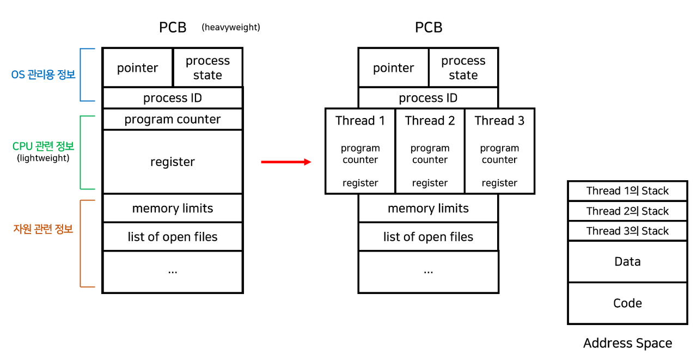
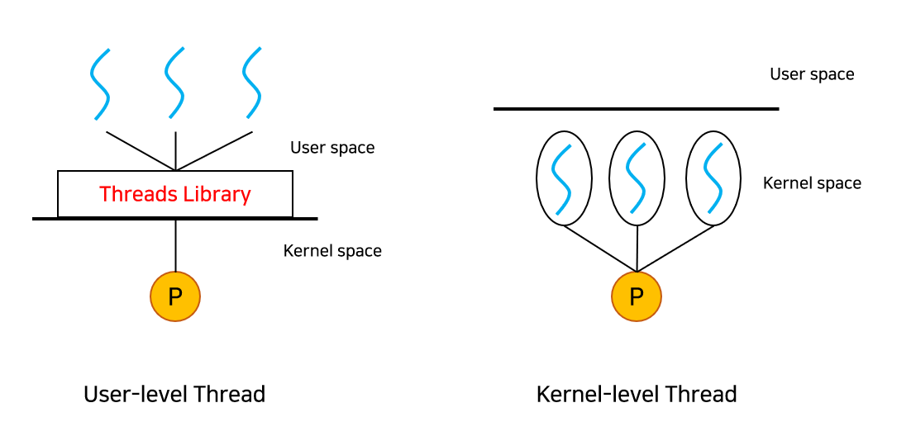
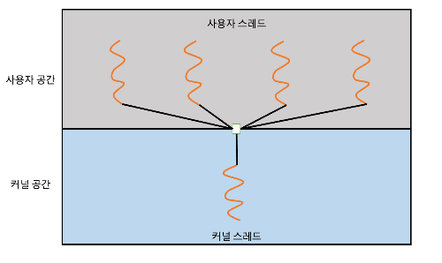
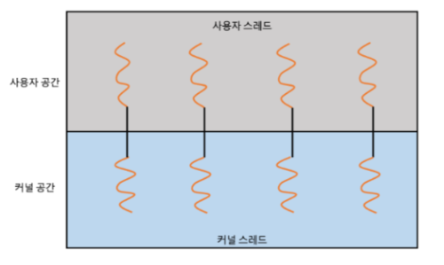
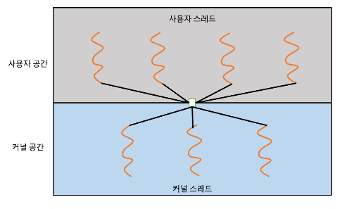
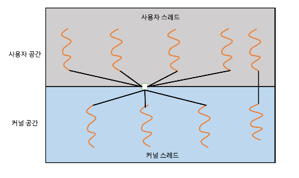

# :books: Process 프로세스

## :bookmark_tabs: 목차

[:arrow_up: **Operating System**](../README.md)

1. ### [Thread](#📕-process-프로세스)
2. ### [Multithreading](#📙-pcb--context-switch)
3. ### [User-level Thread vs Kernel-level Thread](#📗-scheduling--management-스케줄링과-매니지먼트)
4. ### [Threading Issues](#)

# :closed_book: Thread 스레드

## 정의

> CPU 수행의 기본 단위로 프로세스 안의 제어권의 흐름을 의미

## 스레드의 구조

- 스레드가 수행되는 환경을 Task라고 부르기도 함
  - 전통적인 프로세스는 하나의 스레드가 있는 Task와 일치
- 스레드는 Thread ID, Program counter, Register set, Stack space로 구성
  
  - 각각의 스레드는 자신의 레지스터 상태와 스택을 포함함
  - Code, Data 섹션이나 운영체제 자원들은 스레드끼리 공유
- 자원의 일부를 공유하기 때문에 메모리 효율적이고, 문맥 교환시 캐싱 적중률이 올라감
- 스레드의 프로세스 자원 공유는 일부 스레드에 문제가 발생시 프로세스 전체가 문제될 수도 있음
- 스레드는 동작 방식에 따라 Single Thread, Multi Thread로 구분
  - **Single Thread** : 한 프로세스가 하나의 스레드로 한 번에 한 작업만 수행하는 것
  - **Multi Thread** : 한 프로세스가 여러 스레드로 동시에 여러 작업을 수행하는 것

> **프로세스 대신 스레드를 사용하는 이유는?**
>
> - 프로세스를 생성하거나 문맥교환 하는 작업은 너무 무겁고 잦으면 성능 저하가 발생
>   - 스레드를 생성하거나 switching 하는 것은 상대적으로 가벼움
> - 두 프로세스가 하나의 데이터를 공유하려면 메시지 패싱이나 공유 메모리 또는 파이프를 사용
>   - 이러한 기능 구현은 효율이 떨어지고 개발자가 구현, 관리하기도 번거로움

# :orange_book: Multithreading 멀티스레딩

## 멀티스레딩의 특징

- 프로세서가 여러 개인 경우 멀티 스레드를 통해 병렬성Parallelism을 높일 수 있음
- 병렬성은 CPU의 개수에 비례
- 프로세서가 하나인 경우엔 멀티 스레드를 통해 동시성Concurrency을 높일 수 있음
- 한 스레드가 blocked(waiting) 되더라도 커널이 다른 스레드로 switching해 실행할 수 있음
- 하나의 프로세서임에도 불구하고 빠른 처리가 가능하고 계산 속도가 증가

> **병렬성Parallelism이란?**
>
> - 프로세스의 스레드들이 각각 다른 프로세서에서 병렬적으로 여러 작업의 동시 수행 가능한 것

> **동시성Concurrency이란?**
>
> - 실제로는 각각의 시간에 한 작업만 수행되지만, 병렬적으로 수행되는 것처럼 보이는 것

## 멀티스레딩의 장점

**1. 응답성 Responsiveness**

- 싱글 스레드인 경우, 작업이 끝나기 전까지 사용자에게 응답하지 않음
- 멀티 스레드인 경우, 작업을 분리해서 수행하므로 실시간으로 사용자에게 응답할 수 있음

**2. 자원 공유 Resource sharing**

- 프로세스 간의 자원 공유는 오직 공유 메모리나 메시지 패싱을 이용할 때 가능
- 스레드는 자신이 속한 프로세스 내의 스레드들과 메모리나 자원을 공유하여 효율적으로 사용이 가능

**3. 경제성 Economy**

- 프로세스를 새로 생성하는 비용 \< 스레드를 새로 생성하는 비용
- 문맥 교환Context switching의 오버헤드 또한 스레드가 더 경제적
  - ex) Solaris OS에서 프로세스 생성은 스레드 생성보다 30배 느리고, switching은 5배 느림

**4. 확장성 Scalability**

- 싱글 스레드인 경우, 한 프로세스는 오직 한 프로세서에서만 수행 가능
- 멀티 스레드인 경우, 한 프로세스를 여러 프로세서에서 수행할 수 있으므로 훨씬 효율적

# :green_book: Thread Model 스레드 모델

## User-level Thread vs Kernel-level Thread

**1. 유저 스레드 User-level Thread**

- 커널 위에서 커널의 지원 없이 유저 수준의 스레드 라이브러리Thread Library가 관리하는 스레드
- 유저 모드에서 동작하므로 성능 저하가 거의 없음

**2. 커널 스레드 Kernel-level Thread**

- 커널이 지원하는 스레드
- 안정적이지만 사용을 위해 유저 모드에서 커널 모드로 계속 바꿔줘야 하기 때문에 성능이 저하

## Thread Model

- 유저 스레드와 커널 스레드간의 관계를 설명하기 위한 모델

**1. Many-to-One Model**

- 하나의 커널 스레드에 여러 유저 스레드를 연결하는 모델
- 유저 공간의 스레드 라이브러리를 통해서 스레드가 관리되므로 효율적
  - 라이브러리를 위한 모든 코드나 자료구조가 유저 공간에 존재
  - 라이브러리의 함수 호출이 시스템 콜이 아니라 지역 함수 호출하기 때문에 효율이 높음
- 한번에 한 유저 스레드만 커널에 접근할 수 있음
  - 멀티 프로세서 시스템에서 병렬적인 수행을 할 수 없어 요즘에는 잘 사용되지 않는 방식
  - 한 유저 스레드의 시스템 콜로 인해 block되면 프로세스 전체가 block되는 문제가 있음

**2. One-to-One Model**

- 하나의 커널 스레드에 하나의 유저 스레드가 대응하는 모델
- 동시성을 높여주고, 멀티 프로세서 시스템에서 동시에 여러 스레드를 수행할 수 있음
- 유저 스레드를 늘리면 커널 스레드도 똑같이 늘어남
  - 커널 스레드의 생성은 오버헤드가 크기 때문에 성능 저하가 발생할 수 있음

**3. Many-to-Many Model**

- 여러 유저 스레드에 더 적거나 같은 수의 커널 스레드가 대응하는 모델
- 운영체제는 충분한 수의 커널 스레드를 만들 수 있음
- 커널 스레드의 개수는 프로그램이나 작동 기기에 따라 다름
- 멀티 프로세서 시스템에서는 싱글 프로세서 시스템보다 더 많은 커널 스레드가 만들어짐
- 완전한 동시성을 지원하는건 아니지만 Many-to-one Model에 비해 더 높은 동시성을 갖음
- One-to-One Model의 단점인 커널 스레드 생성의 오버헤드도 개선

**4. Two-level Model**

- Many-to-Many Model에서 확장된 개념
- 특정 유저 스레드를 위한 커널 스레드를 별도로 제공하는 모델
- 점유율이 높아야 하는 유저 스레드를 더 빠르게 처리할 수 있음

# :blue_book: Threading Issues 스레딩 이슈

- Multi-threaded 프로그램을 디자인할 때 고려해야 할 내용

**1. Semantics of `fork()` and `exec()` system calls**

- 만약 `fork()` 이후에 `exec()`을 바로 호출한다면 `exec()`으로 인해 스레드를 포함한 전체 프로세스가 대체되기 때문에 모든 스레드를 복제하는 것은 불필요
- 그렇지 않으면 모든 프로세스를 복제
- 몇몇 UNIX 시스템은 두 버전의 `fork()`를 구현 및 제공

**2. Signal Handling**

- 시그널Signal은 특정한 사건이 발생했다고 프로세스에게 알려주기 위해 UNIX 시스템에서 사용하는 것
- 자원이나 시그널의 원인에 따라 두 종류로 구분
  1. **Synchronous signals** : 시그널을 일으킨 작업을 수행한 프로세스에 전달됨
     - ex) division by 0, illegal memory access
  2. **Asynchronous signals** : 수행중인 프로세스의 외부 사건에 의해 만들어진다.
     - ex) Ctrl+C과 같은 특정 키 입력으로 인한 종료, 타이머 종료
- 싱글 스레드 프로그램에서는 시그널이 특정 사건에 의해 생성되고, 프로세스에 전달된 후 다뤄짐
- 멀티 스레드 프로그램에서는 방법이 다양
  - 시그널을 제공한 스레드로 시그널이 전달(ex. Synchronous signals)
  - 프로세스 내의 모든 스레드에 전달(ex. process termination signal)
  - 프로세스 내의 특정한 스레드에 전달(some asynchronous signals to non-blocking threads)
  - 프로세스의 모든 시그널을 전달받는 특별한 스레드를 할당하는 방법을 사용

**3. Thread Cancellation**

- 목표 스레드Target thread가 끝나기 전에 종료시키는 두 방식
  1. Asynchronous cancellation : 목표 스레드를 즉시 종료
  2. Deferred cancellation : 목표 스레드가 종료되어야 하는지 주기적으로 체크

**4. Thread Pools**

- 스레드를 요청할 때마다 매번 새로운 스레드를 생성, 수행, 삭제를 반복하면 성능이 저하
- 스레드 풀Thread Pool에 여러 스레드를 만들어두고 요청이 오면 스레드 풀에 기존에 존재하던 스레드를 할당해주는 방법을 사용
- 새 스레드를 만드는 것보다 기존에 존재하는 스레드를 사용하는 것이 좀 더 빠름
- 많은 양의 스레드를 일정한 크기의 pool 안에 묶어두어 자원 관리가 보다 용이

**5. Thread Local Storage**

- 각각의 스레드들이 자신의 영역을 만들어 관리할 수 있도록 함 (Static Data와 유사)
- 한 함수가 수행되는 동안만 visible한 로컬 변수Local Variable와는 다름
