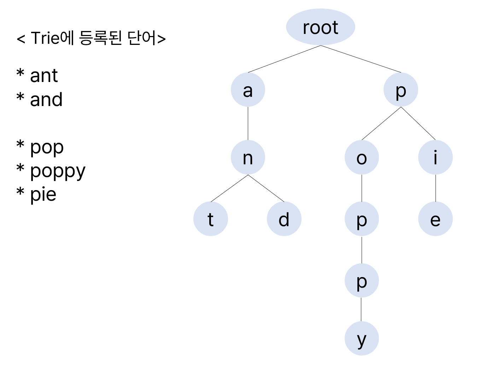
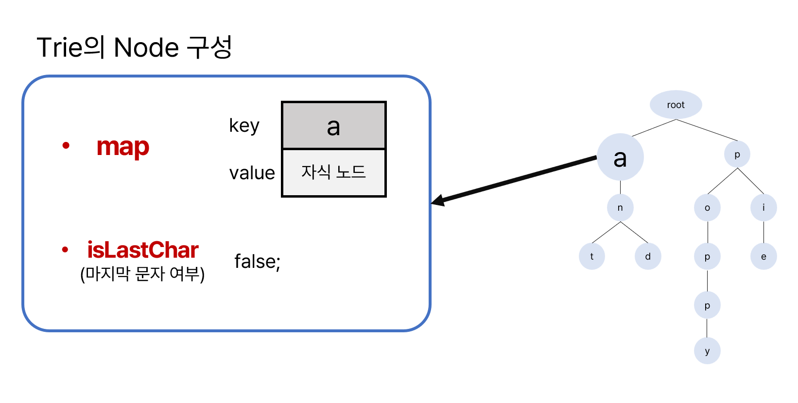
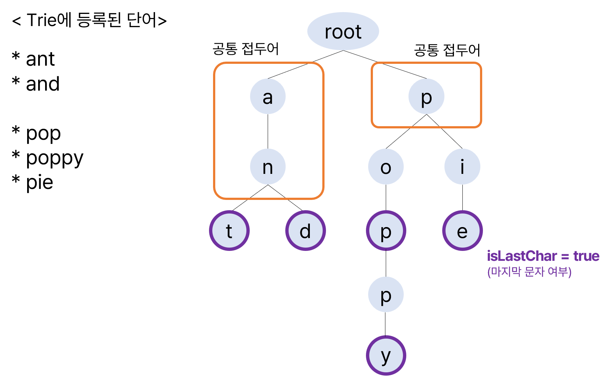

# 트라이(Trie)

### ❓ 문자열 검색을 빠르게 해주는 트리 형태의 자료구조

- 자동완성 기능, 사전 검색 등의 문자열 탐색에 특화되어 있는 자료구조
- **`래딕스(radix tree)`**, **`접두사 트리(prefix tree)`**, **`탐색 트리(retrieval tree)`** 라고도 함.
- 트라이는 re**trie**val tree에서 나온 단어
- **배열**과 **map**을 이용하여 구현할 수 있음.

## Trie 노드 구성

- **`map`** : 문자를 키로 하는 자식 노드를 저장하는 맵
    - **key** : 특정 문자
    - **value** : key에 해당하는 자식 노드
- **`isLastChar`** : 마지막 문자 여부

  

- 위 그림에서 보이는 것처럼 등록한 단어의 마지막 문자에 isLastChar를 true로 설정해줌.
- 루트 노드는 빈 문자가 들어있다. (특정 문자가 할당되어 있지 않음)
- 루트를 제외한 노드의 자손들은 해당 노드와 공통 접두어를 가짐.
    - ‘an’의 자손인 ‘ant’와 ‘and’는 ‘an-’이라는 공통 접두어를 가짐.

  

✔️ 만약 위 그림처럼 pop이 등록되어 있지 않은 경우

- pop을 찾을 순 있지만 pop에서 마지막 문자인 ‘p’의 isLastChar 는 false로 되어있으므로 pop이 등록되지 않은 단어라는 것을 알 수 있음.   
  
     

## 특징

- 정렬된 트리 구조(데이터에 따라 이진 트리일 때도 있음)
    - 데이터가 정렬되어 기 보다는 어떤 규칙에 따라 트리의 노드가 정렬되어 있을 때 사용하는 표현임.
- map으로 구현 시
    - 각 노드는 `map<key, value>`과 `isLastChar`로 구성
    - **key** : 하나의 알파벳
    - **value** : key에 해당하는 자식 노드
    - **isLastChar** : 마지막 글자 여부

### 장점

- 문자열 검색 시 빠름.
    - 대규모 문자열 모음에서도 문자열 검색의 시간 복잡도는 O(N)
    - 검색하고자 하는 문자열이 트라이에 존재하지 않을 경우 검색 시간은 O(N)보다 짧을 수 있음.
- 일반적으로 해시 테이블 보다 효율적
    - 트라이는 접두사 기반으로 검색 가능
    - 해시 테이블은 단어 전체를 통으로 검색해야 함.
    - 이러한 이유로 트라이 구조는 hash 함수의 오버헤드가 없음.

### 단점

- 각 노드에서 자식들에 대한 포인터들을 배열로 모두 저장하고 있기 때문에 저장 공간의 크기가 커져 메모리 측면에서 비효율적일 수 있음.
- 효율적으로 구성된 해시 테이블의 검색 시 O(1)의 시간 복잡도를 가지는데 트라이는 O(N)

 

|  | |
| --- | --- | 
| 데이터들의 input 순서 보장 여부 | yes |
| 중복된 데이터 허용 여부 | no |
| 데이터 정렬 여부 | no(내부 데이터가 정렬되어 있진 않음.) |

 

### ⏰ 시간 복잡도

| funtion | 시간 복잡도 |
|--|--|
| 데이터 추가 | O(N) |
| 데이터 검색 | O(N) |
| 데이터 삭제 | O(N) |

 
 

- map을 이용한 구현

[java를 이용한 Trie 구현 코드](./algorithm/TrieMap.java)

 
 

- 참고

[Introduction to Trie - Data Structure and Algorithm Tutorials - GeeksforGeeks](https://www.geeksforgeeks.org/introduction-to-trie-data-structure-and-algorithm-tutorials/)

[[자료구조] Trie(트라이)-1 : 기초 개념](https://the-dev.tistory.com/2)

[[자료구조 알고리즘] Trie(트라이) Tree에 대해서](https://www.youtube.com/watch?v=TohdsR58i3Q)

[[자료구조] 트라이 (Trie)](https://velog.io/@kimdukbae/자료구조-트라이-Trie)